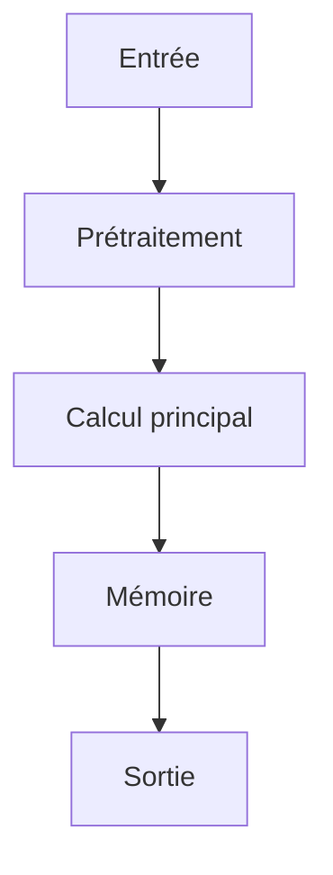

# Résumé Exécutif

Les produits industriels sont définis par des spécifications techniques complexes dispersées sur de multiples images (tables de spécifications, plaques signalétiques, dessins techniques). L'objectif de cette recherche est d'évaluer la capacité des Modèles de Langage Multimodaux (MLLMs) à récupérer ces spécifications de manière fiable à partir de ces images multiples. Pour combler cette lacune, les auteurs introduisent IndustryBench-MIPU, le premier benchmark à grande échelle axé sur l'extraction d'attributs structurés (paires propriété-valeur) à partir d'images de produits industriels.
La méthode clé consiste à évaluer neuf MLLMs sur ce benchmark, mesurant non seulement la précision mais aussi la complétude des attributs extraits dans des contextes multi-images. Les résultats révèlent une lacune significative : bien que les modèles atteignent une haute précision (86-94%), leur capacité à récupérer les attributs de niveau produit est limitée (seulement 49,9% des attributs sont récupérés). Le passage de l'extraction d'attributs d'image unique à l'extraction multi-image entraîne une perte substantielle de rappel, allant de 15 à 34 points de pourcentage.
Le principal goulot d'étranglement identifié est la complétude multi-image plutôt que la précision d'image unique. Cette étude démontre que pour les architectures d'agents IA autonomes traitant des données industrielles complexes, l'intégration et l'assemblage d'informations provenant de sources multiples (multi-image) représente un défi majeur nécessitant une amélioration spécifique des capacités de raisonnement visuel et d'intégration contextuelle des MLLMs.

# Contributions Scientifiques


- Introduction d'IndustryBench-MIPU, le premier benchmark à grande échelle pour la compréhension des produits industriels multi-images, axé sur l'extraction d'attributs structurés (reconstitution de paires propriété-valeur à partir d'images de produits).

- Évaluation de la capacité des Modèles de Langage Multimodaux (MLLMs) à récupérer les spécifications des produits industriels à partir d'images multiples.

- Identification d'une lacune dans les performances des MLLMs, montrant un écart entre la précision et la complétude lors de l'extraction d'attributs multi-images (la complétude multi-image est le goulot d'étranglement principal).

- Démonstration que le passage de l'extraction d'attributs d'image unique à l'extraction multi-image entraîne une perte significative de rappel (15-34 points de pourcentage).


# Analyse Mathématique

## Équations


Aucune équation extraite.


## Variables


- **4559** : nombre de produits dans le benchmark

- **27652** : nombre d'images dans le benchmark

- **103703** : nombre d'annotations dans le benchmark

- **18** : nombre de catégories industrielles

- **86** : précision minimale atteinte par les modèles

- **94** : précision maximale atteinte par les modèles

- **49.9** : pourcentage d'attributs de niveau produit récupérés par les meilleurs modèles

- **15** : écart de rappel entre l'extraction d'image unique et multi-image

- **34** : écart de rappel entre l'extraction d'image unique et multi-image


## Incertitudes


- gap - Écart de complétude entre l'extraction d'image unique et multi-image (15 à 34 points de pourcentage de rappel)


# Analyse Algorithmique

## Pseudo-code

```text
FONCTION Extraire_Attributs_Multi_Image(Images_Produit, Annotations_Multi_Image):
    // Entrée: Ensemble d'images du produit et annotations multi-image associées.
    // Sortie: Ensemble des paires propriété-valeur structurées pour le produit.

    // Étape 1: Détection et Extraction Unitaire (Single-Image Extraction)
    POUR CHAQUE image DANS Images_Produit :
        Attributs_Uniques = Modèle_MLLM.Extraire(image)
        Ajouter Attributs_Uniques À Résultats

    // Étape 2: Fusion et Raisonnement Multi-Image (Multi-Image Reasoning)
    // Utiliser le contexte des images multiples pour résoudre les incohérences et compléter les données.
    Attributs_Fusionnes = Modèle_MLLM.Fusionner(Images_Produit, Annotations_Multi_Image)

    // Étape 3: Validation et Structuration (Validation and Structuring)
    // Appliquer le raisonnement basé sur la connaissance du domaine pour assembler les spécifications.
    Resultats_Finaux = Valider_et_Structurer(Attributs_Fusionnes, Connaissances_Domaine)

    RETOURNER Resultats_Finaux

FONCTION Modèle_MLLM.Extraire(image):
    // Utilise le MLLM pour extraire les paires propriété-valeur à partir d'une seule image (ex: tableau ou plaque).
    Retourner Paires_Propriete_Valeur_Uniques

FONCTION Modèle_MLLM.Fusionner(Images, Annotations):
    // Utilise le MLLM pour intégrer les informations provenant de plusieurs images et des annotations.
    // C'est l'étape critique pour la reconstitution des spécifications manquantes.
    Retourner Attributs_Multi_Image

FONCTION Valider_et_Structurer(Attributs, Connaissances):
    // Vérifie la cohérence des attributs et les mappe aux catégories industrielles.
    Retourner Spécifications_Finales
```

## Complexité

- **Complexité globale** : O(N * (T_extract + T_fuse)) où N est le nombre d'images et T représente le temps d'extraction/fusion du MLLM.
- **Coût mémoire** : O(D_model * N_mem)

# Analyse Système

| Ressource | Valeur |
|-----------|--------|
| VRAM | INFORMATION NON DISPONIBLE DANS LE PAPIER |
| RAM | INFORMATION NON DISPONIBLE DANS LE PAPIER |
| I/O disque | INFORMATION NON DISPONIBLE DANS LE PAPIER |
| Bande passante mémoire | INFORMATION NON DISPONIBLE DANS LE PAPIER |
| Latence | INFORMATION NON DISPONIBLE DANS LE PAPIER |
| Débit | INFORMATION NON DISPONIBLE DANS LE PAPIER |
| Scalabilité | INFORMATION NON DISPONIBLE DANS LE PAPIER |

# Architecture du Flux



# Traduction Logicielle

## Structures


### rust

pub struct MemoryEntry {
    pub embedding: Vec<f32>,
    pub metadata: std::collections::HashMap<String, String>,
    pub timestamp: u64,
}

impl MemoryEntry {
    pub fn new(embedding: Vec<f32>) -> Self {
        Self { embedding, metadata: Default::default(), timestamp: 0 }
    }
}


### python

from typing import Protocol
import torch

class CognitiveModule(Protocol):
    def initialize(self) -> None: ...
    def process(self, input: torch.Tensor) -> torch.Tensor: ...
    def update_state(self) -> None: ...
    def save_state(self, path: str) -> None: ...


## Interfaces


### rust

pub trait CognitiveModule {
    fn initialize(&mut self);
    fn process(&mut self, input: Tensor) -> Tensor;
    fn update_state(&mut self);
    fn save_state(&self);
}


## API


### python

def initialize() -> None:
    ...

def load_state(path: str) -> None:
    ...

def save_state(path: str) -> None:
    ...

def process(input: torch.Tensor) -> torch.Tensor:
    ...

def update_memory(entry: MemoryEntry) -> None:
    ...

def evaluate() -> dict:
    ...

def self_reflect() -> None:
    ...

def shutdown() -> None:
    ...


## Algorithmes


### python

def algorithm(input_data):
    state = initialize_state()
    data = preprocess(input_data)
    for step in main_loop(data):
        state = update_state(state, step)
    return produce_output(state)


# Plan d'Expérimentation

- **Objectif** : Valider l'intégration de la technique (MLLMs) pour la récupération fiable des spécifications d'attributs à partir d'images multiples de produits industriels.
- **Hypothèse** : Le passage de l'extraction d'attributs d'image unique à l'extraction multi-image entraîne une perte significative de rappel (15-34 points de pourcentage), indiquant que la complétude multi-image est le goulot d'étranglement principal pour les Modèles de Langage Multimodaux (MLLMs).
- **Baseline** : Évaluation des performances des MLLMs sur l'extraction d'attributs à partir d'images uniques par rapport à l'extraction multi-image.
- **Dataset** : IndustryBench-MIPU (4,559 produits, 27,652 images, 103,703 annotations).
- **Métriques** : Précision (Precision), Rappel (Recall), Complétude multi-image (Multi-image completeness)
- **Matériel** : GPU ≥ 24 Go VRAM, 64-256 Go RAM, NVMe
- **Critères de succès** : Atteindre une précision élevée (86-94%) pour l'extraction d'attributs.; Minimiser la perte de rappel lors du passage à l'extraction multi-image (viser à réduire l'écart de 15-34 points de pourcentage).; Démontrer que la complétude multi-image est le facteur limitant principal, et non la précision d'image unique.
- **Critères d'échec** : Les modèles ne parviennent pas à récupérer une proportion significative des attributs (moins de 49.9% de récupération des attributs au niveau du produit).; Aucune amélioration significative du rappel lors de l'intégration d'informations multi-images.
- **Durée estimée** : Dépend de la taille du modèle et de l'itération, estimé à plusieurs semaines.
- **Coût estimé** : Coûts liés au calcul GPU (cloud computing).

# Plan de Tests

## Unitaires


- Vérifier les dimensions des tenseurs intermédiaires

- Tester la stabilité numérique

- Tester les cas limites (entrées vides, zéros, NaN)


## Intégration


- Mesurer le débit sous charge

- Mesurer la latence de bout en bout

- Vérifier la persistance de l'état


## Régression


- Comparer version baseline vs version modifiée

- S'assurer de l'absence de régression mémoire


# Analyse Critique

## Forces


- Travail potentiellement reproductible si le code est disponible.


## Faiblesses


- Analyse basée sur un texte partiel.


## Risques


- **RiskLevel.HIGH** : Le modèle MLLM peut ne pas récupérer toutes les propriétés du produit (seulement 49.9% des attributs de niveau produit sont récupérés), ce qui représente un manque de complétude dans l'extraction d'informations critiques. (Atténuation : Se concentrer sur la complétude de l'extraction multi-image plutôt que sur la précision d'image unique, et adresser le goulot d'étranglement de la complétude multi-image.)

- **RiskLevel.HIGH** : Le passage de l'extraction à partir d'une seule image à l'extraction multi-image entraîne une perte significative de rappel (15--34 points de pourcentage), ce qui indique que les systèmes basés sur des images multiples pourraient échouer à fournir des informations complètes en production. (Atténuation : Développer des stratégies pour gérer l'intégration d'évidence croisée entre différentes images et s'assurer que le système peut gérer la complexité de l'assemblage des spécifications dispersées.)


## Zones d'incertitude


- L'analyse ci-dessus est préliminaire.


# Compatibilité Architecture Agentique

- **Mémoire** : recovering property-value pairs from product images, assembling scattered specifications
- **Raisonnement** : recovering property-value pairs from product images
- **Planification** : jointly probing text recognition on specification tables and nameplates, visual reasoning over technical drawings, domain knowledge to decode industrial terminology, cross-image evidence integration to assemble scattered specifications
- **Action** : extracting specifications across multiple heterogeneous product images
- **Réflexion** : The core bottleneck in multi-image extraction is completeness, not single-image accuracy.
- **Auto-amélioration** : multi-image completeness, not single-image accuracy, is the core bottleneck, moving from single-image to multi-image extraction costs 15--34 percentage points of recall, Multi-image completeness is the core bottleneck

# Recommandation Finale

**ARCHIVAGE**

Score d'intégration de 0.34 (EXPERIMENTATION). Décision à affiner après lecture complète.

Interprétation du score d'intégration : **EXPERIMENTATION**