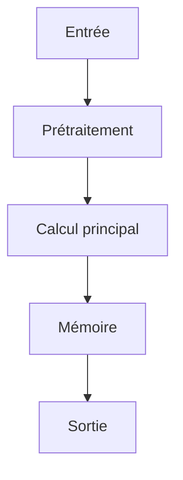

# Résumé Exécutif

L'étude vise à surmonter les limitations des pipelines actuels de Question Answering (QA) audio-visuel, qui se basent souvent sur un paradigme découplé de 'video-caption-QA'. Ces méthodes souffrent d'une absence d'associations inhérentes entre sons et sources visuelles, et produisent des descriptions incohérentes entre segments. L'hypothèse est que l'intégration d'un raisonnement multimodal profond nécessite une compréhension contextuelle à long terme et des connexions inter-modales solides.

Pour y parvenir, les auteurs proposent un moteur de données automatisé composé de deux mécanismes clés : (1) le 'Entity-Anchored Video Scripting', qui transforme les vidéos en scripts structurés incluant des listes d'entités globales pour garantir la cohérence référentielle entre les segments et reconstruire les associations audio-visuelles. (2) la 'Clue-Guided QA Generation', qui guide les modèles à extraire des indices multimodaux intersegments du script avant de générer des paires QA basées sur ces informations de haute valeur.

En utilisant ce pipeline, ils construisent le jeu de données instruction-tuné OmniVideo-100K et un ensemble de test vérifié par l'humain. Le fine-tuning de modèles comme VITA-1.5, Qwen2.5-Omni-7B et Qwen3-Omni-30B sur ce jeu de données produit des gains de performance significatifs allant jusqu'à 20.59% sur OmniVideo-Test, démontrant une forte capacité de généralisation (jusqu'à 12.64% d'améliorations) sur des benchmarks établis comme Daily-Omni et JointAVBench.

# Contributions Scientifiques


- Proposition d'un moteur de données automatisé comprenant deux mécanismes : (1) Entity-Anchored Video Scripting qui transforme les vidéos en scripts structurés comprenant des résumés, des listes d'entités principales et des descriptions audio-visuelles par segment, utilisant la liste d'entités comme une priorité globale pour assurer la cohérence référentielle entre segments et reconstruire les associations audio-visuelles.

- Proposition d'une génération de QA guidée par des indices (Clue-Guided QA Generation) qui incite les modèles à extraire des indices multimodaux intersegments à partir du script, puis à générer des paires QA basées sur ces indices de haute valeur.

- Construction du jeu de données instruction-tuné OmniVideo-100K et d'un ensemble de test vérifié par l'humain, OmniVideo-Test, en utilisant le pipeline proposé.

- Démonstration que l'ajustement fin (fine-tuning) de VITA-1.5, Qwen2.5-Omni-7B et Qwen3-Omni-30B sur OmniVideo-100K produit des gains de performance allant jusqu'à 20.59% sur OmniVideo-Test, démontrant une bonne généralisation (jusqu'à 12.64% d'améliorations) sur des benchmarks établis comme Daily-Omni et JointAVBench.


# Analyse Mathématique

## Équations


Aucune équation extraite.


## Variables


- **20.59%** : performance gains

- **12.64%** : improvements


## Incertitudes


Aucune.


# Analyse Algorithmique

## Pseudo-code

```text
FONCTION Entity_Anchored_Video_Scripting(Video_Set):
    // Étape 1: Identification des entités globales
    Entites_Globales = Identifier_Entites(Video_Set)

    // Étape 2: Génération du script structuré par segment
    Scripts_Segmentaux = VIDEOS_SET
    POUR chaque Segment dans Scripts_Segmentaux:
        Description_Audio_Visuelle = Extraire_Description_AV(Segment)
        Liste_Entites_Segmentales = Identifier_Entites_Segmentales(Segment)
        Script_Segment = { 
            "Summary": Générer_Resume(Segment), 
            "Main_Entities": Liste_Entites_Segmentales, 
            "Audio_Visual_Description": Description_Audio_Visuelle 
        }
        Ajouter Script_Segment à Scripts_Segmentaux

    // Étape 3: Intégration de la cohérence (Utilisation de la liste d'entités comme priorité globale)
    Scripts_Finales = []
    POUR chaque Script_Segment dans Scripts_Segmentaux:
        Script_Final = { 
            "Summary": Script_Segment["Summary"], 
            "Main_Entities": Script_Segment["Main_Entities"], 
            "Audio_Visual_Description": Script_Segment["Audio_Visual_Description"] 
        }
        // Assurer la cohérence référentielle (implique une étape de réalignement basée sur Entites_Globales)
        Script_Final = Realigner_Coherence(Script_Final, Entites_Globales)
        Ajouter Script_Final à Scripts_Finales

    RETOURNER Scripts_Finales

FONCTION Clue_Guided_QA_Generation(Scripts_Finales):
    // Étape 1: Mining des indices multimodaux intersegments
    Indices_Multimodaux = Miner_Indices(Scripts_Finales)

    // Étape 2: Génération des paires QA basées sur les indices
    Paires_QA = []
    POUR chaque Indice dans Indices_Multimodaux:
        Clues = Obtenir_Contexte_Intersegment(Indice)
        QA_Pairs = Generer_QA(Clues, Modèle)
        Ajouter QA_Pairs à Paires_QA
    RETOURNER Paires_QA

// PIPELINE PRINCIPAL:
FONCTION OmniVideo_Pipeline(Videos):
    Scripts = Entity_Anchored_Video_Scripting(Videos)
    QA_Set = Clue_Guided_QA_Generation(Scripts)
    RETOURNER Scripts, QA_Set
```

## Complexité

- **Complexité globale** : Dépend de l'implémentation des fonctions (Identifier_Entites, Realigner_Coherence). Estimation basée sur le traitement séquentiel et la comparaison intersegmentale : O(N*M^2) où N est le nombre de vidéos/segments et M est le nombre d'entités.
- **Coût mémoire** : O(N * L_script + E_global) où N est le nombre de segments, L_script est la longueur du script généré, et E_global est la taille de la liste globale des entités.

# Analyse Système

| Ressource | Valeur |
|-----------|--------|
| VRAM | INFORMATION NON DISPONIBLE DANS LE PAPIER |
| RAM | INFORMATION NON DISPONIBLE DANS LE PAPIER |
| I/O disque | INFORMATION NON DISPONIBLE DANS LE PAPIER |
| Bande passante mémoire | INFORMATION NON DISPONIBLE DANS LE PAPIER |
| Latence | INFORMATION NON DISPONIBLE DANS LE PAPIER |
| Débit | INFORMATION NON DISPONIBLE DANS LE PAPIER |
| Scalabilité | INFORMATION NON DISPONIBLE DANS LE PAPIER |

# Architecture du Flux



# Traduction Logicielle

## Structures


### rust

pub struct MemoryEntry {
    pub embedding: Vec<f32>,
    pub metadata: std::collections::HashMap<String, String>,
    pub timestamp: u64,
}

impl MemoryEntry {
    pub fn new(embedding: Vec<f32>) -> Self {
        Self { embedding, metadata: Default::default(), timestamp: 0 }
    }
}


### python

from typing import Protocol
import torch

class CognitiveModule(Protocol):
    def initialize(self) -> None: ...
    def process(self, input: torch.Tensor) -> torch.Tensor: ...
    def update_state(self) -> None: ...
    def save_state(self, path: str) -> None: ...


## Interfaces


### rust

pub trait CognitiveModule {
    fn initialize(&mut self);
    fn process(&mut self, input: Tensor) -> Tensor;
    fn update_state(&mut self);
    fn save_state(&self);
}


## API


### python

def initialize() -> None:
    ...

def load_state(path: str) -> None:
    ...

def save_state(path: str) -> None:
    ...

def process(input: torch.Tensor) -> torch.Tensor:
    ...

def update_memory(entry: MemoryEntry) -> None:
    ...

def evaluate() -> dict:
    ...

def self_reflect() -> None:
    ...

def shutdown() -> None:
    ...


## Algorithmes


### python

def algorithm(input_data):
    state = initialize_state()
    data = preprocess(input_data)
    for step in main_loop(data):
        state = update_state(state, step)
    return produce_output(state)


# Plan d'Expérimentation

- **Objectif** : Valider l'intégration d'un moteur de données automatisé (Entity-Anchored Video Scripting et Clue-Guided QA Generation) dans une architecture IA autonome pour améliorer le raisonnement audio-visuel à long terme et le raisonnement multimodal.
- **Hypothèse** : L'utilisation du jeu de données structuré OmniVideo-100K, généré par les mécanismes Entity-Anchored Video Scripting et Clue-Guided QA Generation, permettra aux modèles (VITA-1.5, Qwen2.5-Omni-7B, Qwen3-Omni-30B) de généraliser et d'atteindre des performances significativement supérieures sur les tâches de raisonnement multimodal (comme Daily-Omni et JointAVBench) par rapport aux méthodes traditionnelles.
- **Baseline** : Les performances obtenues par le fine-tuning des modèles VITA-1.5, Qwen2.5-Omni-7B et Qwen3-Omni-30B sur les benchmarks établis (Daily-Omni et JointAVBench) sans l'application du pipeline OmniVideo-100K.
- **Dataset** : OmniVideo-100K (jeu de données instruction-tuné) et OmniVideo-Test (ensemble de test vérifié par l'humain).
- **Métriques** : Précision/Score sur OmniVideo-Test, Amélioration par rapport aux benchmarks établis (Daily-Omni, JointAVBench), Cohérence référentielle intersegments (mesure de la cohérence des associations audio-visuelles)
- **Matériel** : GPU ≥ 24 Go VRAM, 64-256 Go RAM, NVMe
- **Critères de succès** : Atteindre une amélioration de performance d'au moins 20.59% sur OmniVideo-Test par rapport aux baselines.; Démontrer des améliorations de généralisation d'au moins 12.64% sur les benchmarks établis (Daily-Omni et JointAVBench).; Valider la capacité du pipeline à reconstruire des associations audio-visuelles cohérentes entre segments grâce à l'Entity-Anchored Video Scripting.
- **Critères d'échec** : Les modèles ne parviennent pas à généraliser les connaissances au-delà des événements localisés.; Le processus de génération de QA guidée par les indices ne produit pas des paires QA de haute valeur.; La cohérence référentielle entre segments est compromise.
- **Durée estimée** : Variable, dépend du temps nécessaire pour le fine-tuning et l'évaluation sur les trois modèles (estimation basée sur la complexité du fine-tuning).
- **Coût estimé** : Dépend des ressources de calcul nécessaires pour le fine-tuning des grands modèles (Qwen3-Omni-30B) et de l'infrastructure cloud utilisée.

# Plan de Tests

## Unitaires


- Vérifier les dimensions des tenseurs intermédiaires

- Tester la stabilité numérique

- Tester les cas limites (entrées vides, zéros, NaN)


## Intégration


- Mesurer le débit sous charge

- Mesurer la latence de bout en bout

- Vérifier la persistance de l'état


## Régression


- Comparer version baseline vs version modifiée

- S'assurer de l'absence de régression mémoire


# Analyse Critique

## Forces


- Travail potentiellement reproductible si le code est disponible.


## Faiblesses


- Analyse basée sur un texte partiel.


## Risques


- **RiskLevel.MEDIUM** : Le découplage du traitement audio-visuel dans les pipelines automatisés actuels sépare les associations inhérentes entre les sons et leurs sources visuelles. Ceci peut entraîner des problèmes de cohérence si le système IA autonome dépend de ces associations pour la compréhension contextuelle. (Atténuation : L'utilisation du mécanisme Entity-Anchored Video Scripting, qui inclut une liste d'entités globale servant de prior pour assurer la cohérence référentielle entre les segments et reconstruire les associations audio-visuelles.)

- **RiskLevel.MEDIUM** : Le traitement indépendant des clips peut causer des descriptions incohérentes de la même entité à travers différents segments. Ceci représente un risque pour la capacité du système IA autonome à maintenir une compréhension globale et cohérente d'une entité sur une séquence temporelle. (Atténuation : L'utilisation de la liste d'entités (entity list) comme prior global dans le script vidéo, visant à garantir la cohérence référentielle à travers les segments.)

- **RiskLevel.HIGH** : Le couplage de la compréhension de longs textes et de la synthèse de QA en une seule étape peut restreindre les modèles aux événements localisés, ce qui conduit à des questions manquant de connexions temporelles à long terme et de raisonnement multimodal profond. Ceci est un risque pour la capacité du système IA autonome à effectuer un raisonnement complexe dans le temps. (Atténuation : Le mécanisme Clue-Guided QA Generation, qui incite les modèles à extraire des indices multimodaux inter-segments à partir du script et à générer des paires de QA basées sur ces indices de haute valeur.)


## Zones d'incertitude


- L'analyse ci-dessus est préliminaire.


# Compatibilité Architecture Agentique

- **Mémoire** : global prior to ensure cross-segment referential consistency, reconstruct audio-visual associations
- **Raisonnement** : mine cross-segment, multimodal clues from the script, generate QA pairs based on these high-value clues
- **Planification** : Entity-Anchored Video Scripting, Clue-Guided QA Generation
- **Action** : transform videos into structured scripts, prompt models to generate QA pairs
- **Réflexion** : demonstrating strong generalization across established benchmarks like Daily-Omni and JointAVBench
- **Auto-amélioration** : construct the instruction-tuning dataset OmniVideo-100K, fine-tuning VITA-1.5, Qwen2.5-Omni-7B and Qwen3-Omni-30B on OmniVideo-100K

# Recommandation Finale

**ARCHIVAGE**

Score d'intégration de 0.42 (EXPERIMENTATION). Décision à affiner après lecture complète.

Interprétation du score d'intégration : **EXPERIMENTATION**