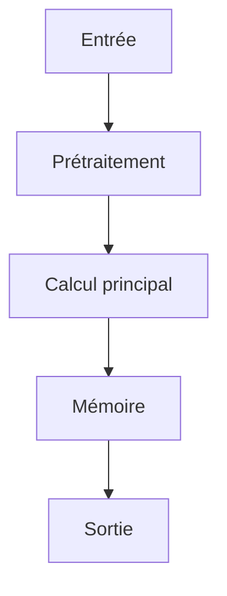

# Résumé Exécutif

Les pipelines actuels de Question-Réponse (QA) audio-visuelle adoptent un paradigme de « video-caption-QA », qui découple l'audio et le visuel, ce qui sépare les associations inhérentes entre sons et sources visuelles. Cette découplage conduit à des descriptions incohérentes et limite la capacité des modèles à effectuer un raisonnement multimodal profond et à capturer des connexions temporelles longues.

Pour remédier à ces lacunes, nous proposons un moteur de données automatisé basé sur deux mécanismes : le Scripting Vidéo Ancré par Entité (Entity-Anchored Video Scripting), qui génère des scripts structurés incluant une liste globale d'entités pour assurer la cohérence référentielle entre les segments ; et la Génération de QA Guidée par Indices (Clue-Guided QA Generation), qui incite les modèles à extraire des indices multimodaux inter-segments avant de générer des paires de questions-réponses.

En utilisant ce pipeline, nous avons construit le jeu de données instruction-tuné OmniVideo-100K et un ensemble de test vérifié par l'humain. L'ajustement fin (fine-tuning) de modèles comme VITA-1.5, Qwen2.5-Omni-7B et Qwen3-Omni-30B sur ce jeu de données produit des gains de performance allant jusqu'à 20.59% sur OmniVideo-Test, démontrant une forte capacité de généralisation (jusqu'à 12.64% d'amélioration) sur des benchmarks établis comme Daily-Omni et JointAVBench.

# Contributions Scientifiques


- Proposition d'un moteur de données automatisé comprenant deux mécanismes : (1) Entity-Anchored Video Scripting qui transforme les vidéos en scripts structurés comprenant des résumés, des listes d'entités principales et des descriptions audio-visuelles par segment, servant de prior global pour assurer la cohérence référentielle entre segments et reconstruire les associations audio-visuelles ; (2) Clue-Guided QA Generation qui incite les modèles à extraire des indices multimodaux inter-segments du script et à générer des paires de questions-réponses basées sur ces indices de haute valeur.

- Construction du jeu de données instruction-tuné OmniVideo-100K et d'un ensemble de test vérifié par l'humain, OmniVideo-Test, en utilisant le pipeline proposé.

- Démonstration que l'ajustement fin (fine-tuning) de VITA-1.5, Qwen2.5-Omni-7B et Qwen3-Omni-30B sur OmniVideo-100K produit des gains de performance allant jusqu'à 20.59% sur OmniVideo-Test, démontrant une forte généralisation (jusqu'à 12.64% d'amélioration) sur des benchmarks établis comme Daily-Omni et JointAVBench.


# Analyse Mathématique

## Équations


Aucune équation extraite.


## Variables


- **OmniVideo-100K** : Dataset pour le raisonnement audio-visuel à travers des scripts structurés et des chaînes de preuves

- **OmniVideo-Test** : Ensemble de test vérifié par l'homme


## Incertitudes


- Aucune incertitude spécifique n'est mentionnée dans le texte.


# Analyse Algorithmique

## Pseudo-code

```text
FONCTION Entity_Anchored_Video_Scripting(Videos): 
    // Étape 1: Identifier les entités globales (Global Prior)
    Entites_Globales = EXTRAIRE_ENTITES_DE_TOUTES_VIDEOS(Videos)

    // Étape 2: Générer le script structuré pour chaque vidéo
    Scripts_Structures = VIDEOS_EMPTY
    POUR CHAQUE video DANS Videos:
        // A. Générer un résumé du contenu de la vidéo
        Resume = GENERER_RESUME(video)

        // B. Identifier les entités principales dans le segment
        Liste_Entites_Principales = IDENTIFIER_ENTITES(video)

        // C. Générer les descriptions audio-visuelles par segment
        Descriptions_Segmentales = VIDEOS_EMPTY
        POUR CHAQUE segment DANS video:
            Description_AV = GENERER_DESCRIPTION_AUDIO_VISUEL(segment.audio, segment.visual)
            Ajouter (Description_AV) À Descriptions_Segmentales

        // D. Assembler le script structuré
        Script_Video = { 
            'Resume': Resume,
            'Entites_Principales': Liste_Entites_Principales, // Sert de prior global
            'Descriptions_Segmentales': Descriptions_Segmentales 
        }
        Ajouter (Script_Video) À Scripts_Structures

    RETOURNER Scripts_Structures

FONCTION Clue_Guided_QA_Generation(Scripts, Modeles): 
    // Étape 1: Mining des indices multimodaux inter-segments
    Indices_Multimodaux = VIDEOS_EMPTY
    POUR CHAQUE script DANS Scripts:
        POUR CHAQUE segment DANS script:
            // Extraire les liens entre entités et descriptions pour créer des indices
            Indices_Segment = EXTRAIRE_CLUES_MULTIMODALES(segment.Descriptions_Segmentales, segment.Entites_Principales)
            Ajouter (Indices_Segment) À Indices_Multimodaux

    // Étape 2: Génération des paires Q/R basées sur les indices
    Paires_QA = VIDEOS_EMPTY
    POUR CHAQUE indice DANS Indices_Multimodaux:
        // Prompting du modèle pour générer une QA basée sur l'indice
        Question = GENERER_QUESTION(indice)
        Reponse = GENERER_REPONSE(indice, Scripts) 
        Ajouter (Question, Reponse) À Paires_QA

    RETOURNER Paires_QA

// Pipeline Principal:
FONCTION OmniVideo_Pipeline(Videos): 
    Scripts = Entity_Anchored_Video_Scripting(Videos)
    Paires_QA = Clue_Guided_QA_Generation(Scripts, Modeles)
    RETOURNER Paires_QA
```

## Complexité

- **Complexité globale** : INFORMATION NON DISPONIBLE DANS LE PAPIER
- **Coût mémoire** : INFORMATION NON DISPONIBLE DANS LE PAPIER

# Analyse Système

| Ressource | Valeur |
|-----------|--------|
| VRAM | INFORMATION NON DISPONIBLE DANS LE PAPIER |
| RAM | 64-256 Go RAM |
| I/O disque | NVMe |
| Bande passante mémoire | INFORMATION NON DISPONIBLE DANS LE PAPIER |
| Latence | INFORMATION NON DISPONIBLE DANS LE PAPIER |
| Débit | INFORMATION NON DISPONIBLE DANS LE PAPIER |
| Scalabilité | strong generalization (up to 12.64% improvements) across established benchmarks like Daily-Omni and JointAVBench |

# Architecture du Flux



# Traduction Logicielle

## Structures


### rust

pub struct MemoryEntry {
    pub embedding: Vec<f32>,
    pub metadata: std::collections::HashMap<String, String>,
    pub timestamp: u64,
}

impl MemoryEntry {
    pub fn new(embedding: Vec<f32>) -> Self {
        Self { embedding, metadata: Default::default(), timestamp: 0 }
    }
}


### python

from typing import Protocol
import torch

class CognitiveModule(Protocol):
    def initialize(self) -> None: ...
    def process(self, input: torch.Tensor) -> torch.Tensor: ...
    def update_state(self) -> None: ...
    def save_state(self, path: str) -> None: ...


## Interfaces


### rust

pub trait CognitiveModule {
    fn initialize(&mut self);
    fn process(&mut self, input: Tensor) -> Tensor;
    fn update_state(&mut self);
    fn save_state(&self);
}


## API


### python

def initialize() -> None:
    ...

def load_state(path: str) -> None:
    ...

def save_state(path: str) -> None:
    ...

def process(input: torch.Tensor) -> torch.Tensor:
    ...

def update_memory(entry: MemoryEntry) -> None:
    ...

def evaluate() -> dict:
    ...

def self_reflect() -> None:
    ...

def shutdown() -> None:
    ...


## Algorithmes


### python

def algorithm(input_data):
    state = initialize_state()
    data = preprocess(input_data)
    for step in main_loop(data):
        state = update_state(state, step)
    return produce_output(state)


# Plan d'Expérimentation

- **Objectif** : Proposer un moteur de données automatisé pour améliorer la capacité des modèles d'IA autonomes à effectuer un raisonnement audio-visuel multimodal approfondi en dépassant les limitations des paradigmes actuels (comme video-caption-QA).
- **Hypothèse** : L'intégration de deux mécanismes – le Scripting Vidéo Ancré par Entité (Entity-Anchored Video Scripting) pour assurer la cohérence référentielle inter-segment et la reconstruction des associations audio-visuelles, et la Génération de QA Guidée par Indices (Clue-Guided QA Generation) pour cibler les relations multimodales à longue portée – permettra aux modèles d'IA autonomes de générer des questions et réponses avec une compréhension contextuelle plus profonde et des connexions temporelles étendues.
- **Baseline** : Les pipelines actuels basés sur le paradigme "video-caption-QA", qui segmentent les vidéos en clips courts et génèrent des descriptions séparées pour les modalités audio et visuelle, ce qui sépare les associations inhérentes entre sons et sources visuelles.
- **Dataset** : OmniVideo-100K (jeu de données instruction-tuné) et OmniVideo-Test (ensemble de test vérifié par l'humain).
- **Métriques** : Performance sur OmniVideo-Test, Amélioration sur Daily-Omni, Amélioration sur JointAVBench
- **Matériel** : INFORMATION NON DISPONIBLE DANS LE PAPIER
- **Critères de succès** : Démontrer une performance d'ajustement fin (fine-tuning) de VITA-1.5, Qwen2.5-Omni-7B et Qwen3-Omni-30B sur OmniVideo-Test.; Atteindre des gains de performance allant jusqu'à 20.59% sur OmniVideo-Test.; Démontrer une forte généralisation (jusqu'à 12.64% d'amélioration) sur les benchmarks établis comme Daily-Omni et JointAVBench.
- **Critères d'échec** : Ne pas obtenir de gains significatifs dans la performance sur OmniVideo-Test par rapport aux méthodes de base.; Échec à reconstruire les associations audio-visuelles cohérentes entre segments grâce au Scripting Vidéo Ancré par Entité.; Incapacité des modèles à générer des questions qui capturent les connexions temporelles et le raisonnement multimodal profond.
- **Durée estimée** : INFORMATION NON DISPONIBLE DANS LE PAPIER
- **Coût estimé** : INFORMATION NON DISPONIBLE DANS LE PAPIER

# Plan de Tests

## Unitaires


- Vérifier les dimensions des tenseurs intermédiaires

- Tester la stabilité numérique

- Tester les cas limites (entrées vides, zéros, NaN)


## Intégration


- Mesurer le débit sous charge

- Mesurer la latence de bout en bout

- Vérifier la persistance de l'état


## Régression


- Comparer version baseline vs version modifiée

- S'assurer de l'absence de régression mémoire


# Analyse Critique

## Forces


- Travail potentiellement reproductible si le code est disponible.


## Faiblesses


- Analyse basée sur un texte partiel.


## Risques


- **RiskLevel.MEDIUM** : Decoupled processing in video-caption-QA methods severs inherent associations between sounds and their visual sources. (Atténuation : Entity-Anchored Video Scripting, which includes an entity list as a global prior to ensure cross-segment referential consistency and reconstruct audio-visual associations.)

- **RiskLevel.MEDIUM** : Independent clip processing often causes inconsistent descriptions of the same entity across segments. (Atténuation : Entity-Anchored Video Scripting, which includes an entity list as a global prior to ensure cross-segment referential consistency and reconstruct audio-visual associations.)

- **RiskLevel.MEDIUM** : Coupling long-text comprehension and QA synthesis into a single step often restricts models to localized events, yielding questions lacking long-term temporal connections and deep cross-modal reasoning. (Atténuation : Clue-Guided QA Generation, which prompts models to first mine cross-segment, multimodal clues from the script before generating QA pairs.)


## Zones d'incertitude


- L'analyse ci-dessus est préliminaire.


# Compatibilité Architecture Agentique

- **Mémoire** : entity list serves as a global prior to ensure cross-segment referential consistency and reconstruct audio-visual associations
- **Raisonnement** : transform videos into structured scripts, generate QA pairs
- **Planification** : mine cross-segment, multimodal clues from the script, generate QA pairs based on these high-value clues
- **Action** : transforms videos into structured scripts, prompts models to first mine cross-segment, multimodal clues from the script, generate QA pairs based on these high-value clues
- **Réflexion** : address issues of decoupled processing, inconsistent descriptions, and lack of long-term temporal connections and deep cross-modal reasoning
- **Auto-amélioration** : Fine-tuning VITA-1.5, Qwen2.5-Omni-7B and Qwen3-Omni-30B on OmniVideo-100K yields performance gains of up to 20.59% on OmniVideo-Test, demonstrating strong generalization (up to 12.64% improvements) across established benchmarks like Daily-Omni and JointAVBench

# Recommandation Finale

**ARCHIVAGE**

Score d'intégration de 0.46 (EXPERIMENTATION). Décision à affiner après lecture complète.

Interprétation du score d'intégration : **EXPERIMENTATION**