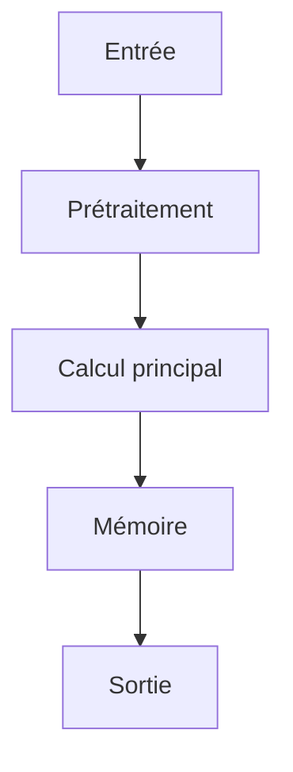

# Résumé Exécutif

L'objectif principal de cette publication est de combler le fossé entre les benchmarks actuels du Text-to-SQL, qui se concentrent sur des scénarios à domaine fermé, et les défis posés par les environnements ouverts, caractérisés par des requêtes ambiguës et inter-bases. Pour y parvenir, les auteurs introduisent TACO, un nouveau benchmark conçu spécifiquement pour évaluer les capacités des systèmes Text-to-SQL dans ces conditions complexes.

La méthode clé consiste à créer TACO en combinant 1 500 exemples réels basés sur un service de données de ville intelligente avec 13 000 exemples synthétiques de haute qualité générés à partir de portails de données ouverts couvrant des domaines variés comme les transports, la santé et la finance. Un pipeline de synthèse de données efficace a été développé pour garantir que ces exemples synthétiques conservent la complexité des requêtes du monde réel. Pour évaluer les limites des approches existantes, une ligne de base TACO-SQL (incluant la réécriture de questions, la liaison de tables et la planification de requêtes) a été introduite.

Les résultats expérimentaux montrent que bien que l'approche TACO-SQL atteigne les meilleurs scores, un écart significatif persiste entre les performances des méthodes existantes et le SQL écrit par l'homme. Ces découvertes soulignent la difficulté intrinsèque du Text-to-SQL en domaine ouvert et positionnent TACO comme un benchmark essentiel pour orienter les recherches futures dans le domaine des architectures d'agents IA autonomes.

# Contributions Scientifiques


- Introduction de TACO, un benchmark pour le Text-to-SQL en domaine ouvert avec des requêtes ambiguës et inter-bases.

- Création de TACO composé de 1500 exemples Text-to-SQL du monde réel basés sur un service de données de ville intelligente et de 13000 exemples synthétiques de haute qualité générés à partir de portails de données ouverts couvrant divers domaines tels que les transports, la santé et la finance.

- Développement d'un pipeline de synthèse de données efficace pour construire les exemples synthétiques tout en préservant la complexité des requêtes du monde réel.

- Introduction d'une ligne de base TACO-SQL (composée de réécriture de questions, liaison de tables et planification de requêtes) pour illustrer les défis posés par TACO et mieux comprendre les limitations des approches Text-to-SQL existantes.

- Démonstration que malgré les meilleurs résultats obtenus avec TACO-SQL, un écart significatif subsiste entre les approches existantes et le SQL écrit par l'homme, soulignant la difficulté du Text-to-SQL en domaine ouvert et positionnant TACO comme un benchmark précieux pour guider la recherche future.


# Analyse Mathématique

## Équations


Aucune équation extraite.


## Variables


- **TACO** : A Benchmark for Open-Domain Text-to-SQL with Ambiguous and Cross-Database Queries


## Incertitudes


- significant gap still remains between the existing approaches and human-written SQL


# Analyse Algorithmique

## Pseudo-code

```text
FONCTION Generer_Exemples_TACO()
    // 1. Charger exemples réels
    Exemples_Reels = Charger_1500_Exemples_Text_to_SQL_Reels()

    // 2. Générer exemples synthétiques
    Exemples_Synthetiques = GENERER_SYNTHESE_DE_DONNEES(Portails_Donnees_Ouverts, Domaine_Divers)

    // 3. Construire le benchmark TACO
    TACO_Set = Exemples_Reels ∨ Exemples_Synthetiques

    // 4. Développer la ligne de base TACO-SQL (Baseline)
    TACO_SQL_Baseline = INITIALISER_TACO_SQL()
    
    // 5. Entraîner/Évaluer les approches Text-to-SQL sur TACO
    POUR CHAQUE exemple DANS TACO_Set:
        Appliquer_Approche_Text_to_SQL(exemple, Modèle)
        Calculer_Performance(Résultat, SQL_Humain)

    RETOURNER TACO_Set, TACO_SQL_Baseline
```

## Complexité

- **Complexité globale** : INFORMATION NON DISPONIBLE DANS LE PAPIER
- **Coût mémoire** : INFORMATION NON DISPONIBLE DANS LE PAPIER

# Analyse Système

| Ressource | Valeur |
|-----------|--------|
| VRAM | INFORMATION NON DISPONIBLE DANS LE PAPIER |
| RAM | INFORMATION NON DISPONIBLE DANS LE PAPIER |
| I/O disque | INFORMATION NON DISPONIBLE DANS LE PAPIER |
| Bande passante mémoire | INFORMATION NON DISPONIBLE DANS LE PAPIER |
| Latence | INFORMATION NON DISPONIBLE DANS LE PAPIER |
| Débit | INFORMATION NON DISPONIBLE DANS LE PAPIER |
| Scalabilité | INFORMATION NON DISPONIBLE DANS LE PAPIER |

# Architecture du Flux



# Traduction Logicielle

## Structures


### rust

pub struct MemoryEntry {
    pub embedding: Vec<f32>,
    pub metadata: std::collections::HashMap<String, String>,
    pub timestamp: u64,
}

impl MemoryEntry {
    pub fn new(embedding: Vec<f32>) -> Self {
        Self { embedding, metadata: Default::default(), timestamp: 0 }
    }
}


### python

from typing import Protocol
import torch

class CognitiveModule(Protocol):
    def initialize(self) -> None: ...
    def process(self, input: torch.Tensor) -> torch.Tensor: ...
    def update_state(self) -> None: ...
    def save_state(self, path: str) -> None: ...


## Interfaces


### rust

pub trait CognitiveModule {
    fn initialize(&mut self);
    fn process(&mut self, input: Tensor) -> Tensor;
    fn update_state(&mut self);
    fn save_state(&self);
}


## API


### python

def initialize() -> None:
    ...

def load_state(path: str) -> None:
    ...

def save_state(path: str) -> None:
    ...

def process(input: torch.Tensor) -> torch.Tensor:
    ...

def update_memory(entry: MemoryEntry) -> None:
    ...

def evaluate() -> dict:
    ...

def self_reflect() -> None:
    ...

def shutdown() -> None:
    ...


## Algorithmes


### python

def algorithm(input_data):
    state = initialize_state()
    data = preprocess(input_data)
    for step in main_loop(data):
        state = update_state(state, step)
    return produce_output(state)


# Plan d'Expérimentation

- **Objectif** : Valider l'intégration de techniques dans une architecture IA autonome pour résoudre le problème du Text-to-SQL en domaine ouvert avec requêtes ambiguës et inter-bases.
- **Hypothèse** : L'utilisation d'un benchmark comme TACO, combinée à des méthodes basées sur la réécriture de questions, la liaison de tables et la planification de requêtes (TACO-SQL), permettra d'améliorer significativement les performances des approches Text-to-SQL existantes par rapport au SQL écrit par l'homme.
- **Baseline** : TACO-SQL (composé de réécriture de questions, liaison de tables et planification de requêtes).
- **Dataset** : TACO, composé de 1500 exemples Text-to-SQL du monde réel basés sur un service de données de ville intelligente et 13000 exemples synthétiques de haute qualité générés à partir de portails de données ouverts (domaines : transports, santé, finance).
- **Métriques** : Précision de la génération SQL (vs. SQL humain), Efficacité de la liaison des tables, Qualité de la planification de la requête, Taux de résolution des requêtes ambiguës et inter-bases
- **Matériel** : INFORMATION NON DISPONIBLE DANS LE PAPIER
- **Critères de succès** : Atteindre les meilleurs résultats possibles avec TACO-SQL.; Réduire l'écart significatif entre les approches existantes et le SQL écrit par l'homme.
- **Critères d'échec** : Échec à gérer efficacement les requêtes ambiguës et inter-bases.; Performance inférieure au niveau du SQL humain malgré l'utilisation de TACO-SQL.
- **Durée estimée** : INFORMATION NON DISPONIBLE DANS LE PAPIER
- **Coût estimé** : INFORMATION NON DISPONIBLE DANS LE PAPIER

# Plan de Tests

## Unitaires


- Vérifier les dimensions des tenseurs intermédiaires

- Tester la stabilité numérique

- Tester les cas limites (entrées vides, zéros, NaN)


## Intégration


- Mesurer le débit sous charge

- Mesurer la latence de bout en bout

- Vérifier la persistance de l'état


## Régression


- Comparer version baseline vs version modifiée

- S'assurer de l'absence de régression mémoire


# Analyse Critique

## Forces


- Travail potentiellement reproductible si le code est disponible.


## Faiblesses


- Analyse basée sur un texte partiel.


## Risques


- **RiskLevel.HIGH** : Difficulté de gérer les requêtes ambiguës et les requêtes inter-bases dans des scénarios de domaine ouvert (open-domain) (Atténuation : Développer des méthodes robustes pour la résolution d'ambiguïtés sémantiques et la gestion des relations entre bases de données.)

- **RiskLevel.MEDIUM** : Écart significatif entre les performances des approches actuelles et le SQL écrit par l'humain, même avec un benchmark spécifique (TACO-SQL) (Atténuation : Améliorer les algorithmes pour combler l'écart de performance avec le SQL humain dans des contextes complexes.)


## Zones d'incertitude


- L'analyse ci-dessus est préliminaire.


# Compatibilité Architecture Agentique

- **Mémoire** : TACO is a benchmark for open-domain Text-to-SQL with Ambiguous and Cross-database queries, TACO consists of 1,500 real-world Text-to-SQL examples based on a smart city data service and 13,000 high-quality synthetic examples generated based on large-scale open data portals, covering diverse domains such as transportation, healthcare, and finance
- **Raisonnement** : TACO-SQL achieves the best results when applied to the benchmark
- **Planification** : develop an effective data synthesis pipeline that preserves the complexity of real-world queries, introduce a baseline TACO-SQL composed of question rewriting, table linking, and query planning to illustrate the challenges posed by TACO
- **Action** : Extensive experiments on TACO using a variety of recent Text-to-SQL approaches
- **Réflexion** : TACO is a valuable benchmark to drive future research
- **Auto-amélioration** : a significant gap still remains between the existing approaches and human-written SQL, highlight the difficulty of open-domain Text-to-SQL

# Recommandation Finale

**REJET**

Score d'intégration de 0.28 (NON PRIORITAIRE). Décision à affiner après lecture complète.

Interprétation du score d'intégration : **NON PRIORITAIRE**