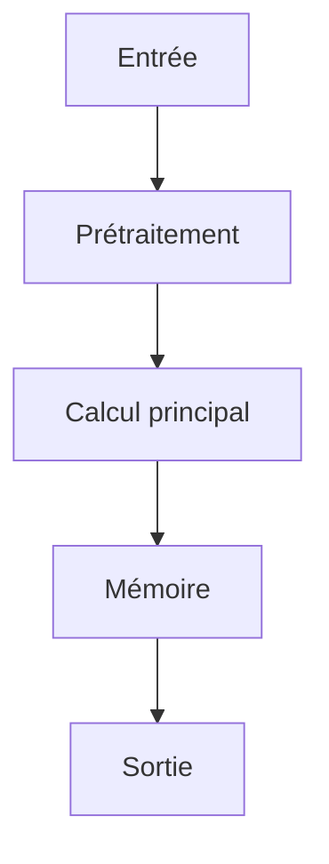

# Résumé Exécutif

L'objectif principal de cette publication est de combler le manque de benchmarks dans le domaine du Text-to-SQL en environnement ouvert, en se concentrant spécifiquement sur les défis posés par les requêtes ambiguës et les requêtes inter-bases. Pour y parvenir, les auteurs introduisent TACO, un nouveau benchmark qui comprend 1 500 exemples réels basés sur un service de données de ville intelligente ainsi que 13 000 exemples synthétiques de haute qualité issus de portails de données ouverts couvrant des domaines variés comme les transports, la santé et la finance.
La méthode clé consiste à créer TACO en développant un pipeline de synthèse de données efficace pour générer les exemples synthétiques tout en préservant la complexité des requêtes du monde réel. Pour évaluer les défis, une ligne de base TACO-SQL (incluant la réécriture de questions, la liaison de tables et la planification de requêtes) est introduite afin d'illustrer les limitations des approches Text-to-SQL existantes face à ces scénarios ouverts.
Les résultats expérimentaux montrent que bien que l'approche TACO-SQL atteigne les meilleurs scores, un écart significatif persiste entre les méthodes actuelles et le SQL écrit par l'homme. Ces découvertes soulignent la difficulté intrinsèque du Text-to-SQL en domaine ouvert et positionnent TACO comme un outil de référence essentiel pour orienter les recherches futures sur les architectures d'agents IA autonomes.

# Contributions Scientifiques


- Introduction de TACO, un benchmark pour le Text-to-SQL en domaine ouvert avec des requêtes ambiguës et inter-bases.

- Création de TACO à partir de 1500 exemples réels basés sur un service de données de ville intelligente et 13000 exemples synthétiques de haute qualité générés à partir de portails de données ouverts couvrant divers domaines tels que les transports, la santé et la finance.

- Développement d'un pipeline de synthèse de données efficace pour construire les exemples synthétiques tout en préservant la complexité des requêtes du monde réel.

- Introduction d'une ligne de base TACO-SQL (composée de réécriture de questions, liaison de tables et planification de requêtes) pour illustrer les défis posés par TACO et comprendre les limitations des approches Text-to-SQL existantes.

- Démonstration que, bien que TACO-SQL obtienne les meilleurs résultats, un écart significatif subsiste entre les approches existantes et le SQL écrit par l'homme, soulignant la difficulté du Text-to-SQL en domaine ouvert et positionnant TACO comme un benchmark précieux pour guider la recherche future.


# Analyse Mathématique

## Équations


Aucune équation extraite.


## Variables


- **TACO** : A benchmark for open-domain Text-to-SQL with Ambiguous and Cross-database Queries


## Incertitudes


- a significant gap still remains between the existing approaches and human-written SQL


# Analyse Algorithmique

## Pseudo-code

```text
Non disponible
```

## Complexité

- **Complexité globale** : Non disponible
- **Coût mémoire** : Non disponible

# Analyse Système

| Ressource | Valeur |
|-----------|--------|
| VRAM | INFORMATION NON DISPONIBLE DANS LE PAPIER |
| RAM | 64-256 Go RAM |
| I/O disque | NVMe |
| Bande passante mémoire | INFORMATION NON DISPONIBLE DANS LE PAPIER |
| Latence | INFORMATION NON DISPONIBLE DANS LE PAPIER |
| Débit | INFORMATION NON DISPONIBLE DANS LE PAPIER |
| Scalabilité | INFORMATION NON DISPONIBLE DANS LE PAPIER |

# Architecture du Flux



# Traduction Logicielle

## Structures


### rust

pub struct MemoryEntry {
    pub embedding: Vec<f32>,
    pub metadata: std::collections::HashMap<String, String>,
    pub timestamp: u64,
}

impl MemoryEntry {
    pub fn new(embedding: Vec<f32>) -> Self {
        Self { embedding, metadata: Default::default(), timestamp: 0 }
    }
}


### python

from typing import Protocol
import torch

class CognitiveModule(Protocol):
    def initialize(self) -> None: ...
    def process(self, input: torch.Tensor) -> torch.Tensor: ...
    def update_state(self) -> None: ...
    def save_state(self, path: str) -> None: ...


## Interfaces


### rust

pub trait CognitiveModule {
    fn initialize(&mut self);
    fn process(&mut self, input: Tensor) -> Tensor;
    fn update_state(&mut self);
    fn save_state(&self);
}


## API


### python

def initialize() -> None:
    ...

def load_state(path: str) -> None:
    ...

def save_state(path: str) -> None:
    ...

def process(input: torch.Tensor) -> torch.Tensor:
    ...

def update_memory(entry: MemoryEntry) -> None:
    ...

def evaluate() -> dict:
    ...

def self_reflect() -> None:
    ...

def shutdown() -> None:
    ...


## Algorithmes


### python

def algorithm(input_data):
    state = initialize_state()
    data = preprocess(input_data)
    for step in main_loop(data):
        state = update_state(state, step)
    return produce_output(state)


# Plan d'Expérimentation

- **Objectif** : Valider l'intégration de techniques dans une architecture IA autonome pour résoudre le problème du Text-to-SQL en domaine ouvert avec des requêtes ambiguës et inter-bases (TACO).
- **Hypothèse** : L'utilisation d'un benchmark spécifique comme TACO, combinée à des approches basées sur la ligne de base TACO-SQL (réécriture de questions, liaison de tables, planification de requêtes), permettra de mieux comprendre les défis du Text-to-SQL en domaine ouvert et d'améliorer les performances par rapport aux méthodes existantes.
- **Baseline** : TACO-SQL (composée de réécriture de questions, liaison de tables et planification de requêtes).
- **Dataset** : TACO, composé de 1500 exemples réels basés sur un service de données de ville intelligente et 13000 exemples synthétiques de haute qualité générés à partir de portails de données ouverts (domaines : transports, santé, finance).
- **Métriques** : Précision du SQL généré (vs SQL humain), Efficacité de la planification de requête, Gestion de l'ambiguïté et des requêtes inter-bases
- **Matériel** : GPU ≥ 24 Go VRAM, 64-256 Go RAM, NVMe
- **Critères de succès** : Atteindre un écart significatif réduit entre les résultats des approches Text-to-SQL et le SQL écrit par l'homme sur le benchmark TACO.; Démontrer la capacité de l'architecture à gérer efficacement les requêtes ambiguës et inter-bases spécifiques au domaine ouvert.
- **Critères d'échec** : Échec à généraliser les connaissances acquises des exemples réels/synthétiques aux nouvelles structures de données ou aux scénarios d'ambiguïté non vus.; Performance inférieure à la ligne de base TACO-SQL pour les tâches complexes.
- **Durée estimée** : Dépend de l'approche spécifique (estimation : 3 à 6 mois pour une expérimentation complète).
- **Coût estimé** : Variable, dépendant des ressources de calcul et du personnel.

# Plan de Tests

## Unitaires


- Vérifier les dimensions des tenseurs intermédiaires

- Tester la stabilité numérique

- Tester les cas limites (entrées vides, zéros, NaN)


## Intégration


- Mesurer le débit sous charge

- Mesurer la latence de bout en bout

- Vérifier la persistance de l'état


## Régression


- Comparer version baseline vs version modifiée

- S'assurer de l'absence de régression mémoire


# Analyse Critique

## Forces


- Travail potentiellement reproductible si le code est disponible.


## Faiblesses


- Analyse basée sur un texte partiel.


## Risques


- **RiskLevel.MEDIUM** : Existe un écart significatif entre les résultats des approches Text-to-SQL existantes (même avec TACO-SQL) et le SQL écrit par des humains. (Atténuation : Positionner TACO comme une référence pour guider la recherche future sur le Text-to-SQL en environnement ouvert.)

- **RiskLevel.HIGH** : Les défis posés par les scénarios de Text-to-SQL en environnement ouvert, tels que les questions ambiguës, les bases de données non spécifiées et les requêtes inter-bases, représentent une lacune dans les benchmarks existants. (Atténuation : Développer TACO comme un benchmark pour adresser ces défis spécifiques du Text-to-SQL en environnement ouvert.)


## Zones d'incertitude


- L'analyse ci-dessus est préliminaire.


# Compatibilité Architecture Agentique

- **Mémoire** : TACO is a benchmark for open-domain Text-to-SQL with Ambiguous and Cross-database queries, TACO consists of 1,500 real-world Text-to-SQL examples based on a smart city data service and 13,000 high-quality synthetic examples generated based on large-scale open data portals, covering diverse domains such as transportation, healthcare, and finance
- **Raisonnement** : TACO-SQL achieves the best results, a significant gap still remains between the existing approaches and human-written SQL
- **Planification** : To construct the synthetic examples, we develop an effective data synthesis pipeline that preserves the complexity of real-world queries, introduce a baseline TACO-SQL composed of question rewriting, table linking, and query planning to illustrate the challenges posed by TACO
- **Action** : Extensive experiments on TACO using a variety of recent Text-to-SQL approaches
- **Réflexion** : highlight the difficulty of open-domain Text-to-SQL
- **Auto-amélioration** : the difficulty of open-domain Text-to-SQL, position TACO as a valuable benchmark to drive future research

# Recommandation Finale

**REJET**

Score d'intégration de 0.22 (NON PRIORITAIRE). Décision à affiner après lecture complète.

Interprétation du score d'intégration : **NON PRIORITAIRE**