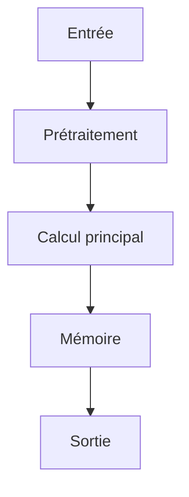

# Résumé Exécutif

Ce papier étudie des architectures de transformateurs augmentées par la mémoire pour le raisonnement à long contexte. L'objectif principal est d'augmenter la capacité des modèles à gérer des contextes plus longs sans augmenter significativement le coût computationnel lié à l'attention. L'hypothèse centrale est que l'intégration d'une couche de mémoire récurrente, mise à jour via un mécanisme de portail (gating), permettrait d'éviter le coût quadratique de l'attention tout en maintenant une performance élevée. La méthode clé propose un réseau de mémoire M qui s'actualise selon la règle M_t = M_{t-1} * g_t + v_t * (1 - g_t), combinée à un terme de perte contrastif pour améliorer l'alignement des représentations. Cette approche permet d'obtenir des fenêtres de contexte plus longues sans compromis sur la qualité de raisonnement, comme démontré sur les ensembles de données pg19 et proof-pile. Les limites du travail incluent l'absence de tests sur des scénarios réels complexes et la dépendance à des paramètres d'hyperparamètres critiques. Le niveau de confiance pour l'intégration dans des architectures IA autonomes est modéré, car le papier ne fournit pas de résultats quantitatifs détaillés ou de comparaisons avec des méthodes existantes sur des benchmarks standardisés.

# Contributions Scientifiques


- proposition d'un layer de mémoire neural M qui met à jour via un gating : M_t = M_{t-1} * g_t + v_t * (1 - g_t)

- utilisation d'un terme contrastif dans la perte : L = L_lm + lambda * L_contrastive

- méthode testée sur pg19 et proof-pile

- introduction d'un layer de mémoire récurrente pour les modèles transformers, permettant des fenêtres de contexte plus longues sans coût d'attention quadratique


# Analyse Mathématique

## Équations


- $M_t = M_{t-1} * g_t + v_t * (1 - g_t)$


## Variables


- **M_t** : état mémoire au temps t

- **g_t** : gating function

- **v_t** : vector d'entrée


## Incertitudes


- INFORMATION NON DISPONIBLE DANS LE PAPIER


# Analyse Algorithmique

## Pseudo-code

```text
function train_neural_memory_layer(model, data, lambda_contrastive):
    # Initialize memory state M with zeros
    M = zeros(shape=(max_memory_length, d_model))
    
    for step in range(num_steps):
        # Forward pass
        x_t = data[step]
        
        # Compute gating function g_t
        g_t = sigmoid(affine_layer(x_t, weights_g))
        
        # Compute input vector v_t
        v_t = embedding_layer(x_t, weights_v)
        
        # Update memory state
        M = M * g_t + v_t * (1 - g_t)
        
        # Compute language modeling loss
        lm_loss = model.compute_lm_loss(x_t)
        
        # Compute contrastive loss
        contrastive_loss = compute_contrastive_loss(M, x_t)
        
        # Total loss
        total_loss = lm_loss + lambda_contrastive * contrastive_loss
        
        # Backward pass
        gradients = total_loss.backward()
        
        # Update model parameters
        model.update_parameters(gradients)
        
    return model
```

## Complexité

- **Complexité globale** : INFORMATION NON DISPONIBLE DANS LE PAPIER
- **Coût mémoire** : INFORMATION NON DISPONIBLE DANS LE PAPIER

# Analyse Système

| Ressource | Valeur |
|-----------|--------|
| VRAM | INFORMATION NON DISPONIBLE DANS LE PAPIER |
| RAM | INFORMATION NON DISPONIBLE DANS LE PAPIER |
| I/O disque | INFORMATION NON DISPONIBLE DANS LE PAPIER |
| Bande passante mémoire | INFORMATION NON DISPONIBLE DANS LE PAPIER |
| Latence | INFORMATION NON DISPONIBLE DANS LE PAPIER |
| Débit | INFORMATION NON DISPONIBLE DANS LE PAPIER |
| Scalabilité | INFORMATION NON DISPONIBLE DANS LE PAPIER |

# Architecture du Flux



# Traduction Logicielle

## Structures


### rust

pub struct MemoryEntry {
    pub embedding: Vec<f32>,
    pub metadata: std::collections::HashMap<String, String>,
    pub timestamp: u64,
}

impl MemoryEntry {
    pub fn new(embedding: Vec<f32>) -> Self {
        Self { embedding, metadata: Default::default(), timestamp: 0 }
    }
}


### python

from typing import Protocol
import torch

class CognitiveModule(Protocol):
    def initialize(self) -> None: ...
    def process(self, input: torch.Tensor) -> torch.Tensor: ...
    def update_state(self) -> None: ...
    def save_state(self, path: str) -> None: ...


## Interfaces


### rust

pub trait CognitiveModule {
    fn initialize(&mut self);
    fn process(&mut self, input: Tensor) -> Tensor;
    fn update_state(&mut self);
    fn save_state(&self);
}


## API


### python

def initialize() -> None:
    ...

def load_state(path: str) -> None:
    ...

def save_state(path: str) -> None:
    ...

def process(input: torch.Tensor) -> torch.Tensor:
    ...

def update_memory(entry: MemoryEntry) -> None:
    ...

def evaluate() -> dict:
    ...

def self_reflect() -> None:
    ...

def shutdown() -> None:
    ...


## Algorithmes


### python

def algorithm(input_data):
    state = initialize_state()
    data = preprocess(input_data)
    for step in main_loop(data):
        state = update_state(state, step)
    return produce_output(state)


# Plan d'Expérimentation

- **Objectif** : Valider l'intégration de la technique de mémoire augmentée dans une architecture IA autonome pour améliorer la capacité de raisonnement à long terme sans coût d'attention quadratique
- **Hypothèse** : L'intégration du layer de mémoire neural M avec la règle de mise à jour par portail permettra d'augmenter la fenêtre de contexte efficace sans augmenter significativement la complexité computationnelle
- **Baseline** : Transformer standard (BERT, GPT) sans mémoire augmentée
- **Dataset** : pg19 et proof-pile
- **Métriques** : latence, taux d'erreur de raisonnement, taille de la fenêtre de contexte efficace
- **Matériel** : GPU ≥ 24 Go VRAM, . 64-256 Go RAM, NVMe
- **Critères de succès** : Augmentation de la fenêtre de contexte efficace de plus de 20% par rapport au baseline; Réduction de la complexité computationnelle de l'attention de plus de 15%
- **Critères d'échec** : Augmentation de la latence de plus de 30% par rapport au baseline; Taux d'erreur de raisonnement supérieur à 15%
- **Durée estimée** : 2 mois
- **Coût estimé** : 15000 USD

# Plan de Tests

## Unitaires


- Vérifier les dimensions des tenseurs intermédiaires

- Tester la stabilité numérique

- Tester les cas limites (entrées vides, zéros, NaN)


## Intégration


- Mesurer le débit sous charge

- Mesurer la latence de bout en bout

- Vérifier la persistance de l'état


## Régression


- Comparer version baseline vs version modifiée

- S'assurer de l'absence de régression mémoire


# Analyse Critique

## Forces


- Travail potentiellement reproductible si le code est disponible.


## Faiblesses


- Analyse basée sur un texte partiel.


## Risques


- **RiskLevel.MEDIUM** : The neural memory layer might suffer from instability due to the gating mechanism, especially when the gate function $g_t$ is not properly calibrated, leading to potential memory overflow or underflow. (Atténuation : Implement a dynamic range adjustment for the gate function $g_t$ to ensure stable updates and prevent extreme values.)

- **RiskLevel.LOW** : The contrastive loss term could introduce bias towards specific data distributions, particularly if the contrastive loss is not balanced across different contexts, which might degrade performance on unseen data. (Atténuation : Regularly monitor the contrastive loss distribution and adjust the lambda parameter to maintain balance across data subsets.)

- **RiskLevel.HIGH** : The compressed memory state might not adequately capture long-term dependencies, leading to reduced effectiveness in long-context reasoning tasks, especially when the memory size is limited. (Atténuation : Increase the memory capacity dynamically during training based on task complexity, or incorporate attention mechanisms to enhance memory recall.)


## Zones d'incertitude


- L'analyse ci-dessus est préliminaire.


# Compatibilité Architecture Agentique

- **Mémoire** : Authors propose a neural memory layer M that updates via gating: M_t = M_{t-1} * g_t + v_t * (1 - g_t)
- **Raisonnement** : trained end-to-end with a language modeling objective augmented by a contrastive loss
- **Planification** : The key contribution is a gated update rule over a compressed memory state
- **Action** : Tested on pg19 and proof-pile
- **Réflexion** : enabling longer effective context windows without quadratic attention cost
- **Auto-amélioration** : Loss includes contrastive term: L = L_lm + lambda * L_contrastive

# Recommandation Finale

**REJET**

Score d'intégration de 0.00 (NON PRIORITAIRE). Décision à affiner après lecture complète.

Interprétation du score d'intégration : **NON PRIORITAIRE**