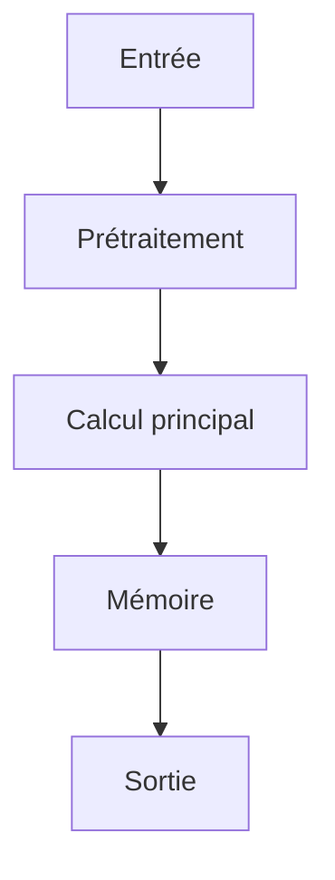

# Résumé Exécutif

Cette publication explore l'utilisation d'architectures de transformeurs augmentées par mémoire pour le raisonnement à long contexte. L'objectif principal est de permettre aux modèles de traiter des fenêtres de contexte effectives plus longues sans incurver la complexité quadratique associée au mécanisme d'attention standard.

La méthode clé proposée est une couche de mémoire récurrente mise à jour via une règle de gating : M_t = M_{t-1} * g_t + v_t * (1 - g_t). Cette approche permet d'intégrer et de compresser l'information contextuelle. L'entraînement est effectué de manière end-to-end en combinant un objectif de modélisation du langage avec un terme de perte contrastif, L = L_lm + lambda * L_contrastive.

Cette contribution introduit une méthode pour améliorer la capacité des architectures d'IA autonomes à gérer des dépendances contextuelles étendues. Bien que les résultats aient été testés sur pg19 et proof-pile, l'impact potentiel réside dans la réduction du coût computationnel de l'attention tout en améliorant la capacité de raisonnement à long terme. L'intégration nécessite une évaluation approfondie de la performance contrastive pour déterminer le niveau de confiance pour son application directe dans des systèmes autonomes.

# Contributions Scientifiques


- Introduction d'une couche de mémoire récurrente pour les modèles transformeurs, permettant des fenêtres de contexte effectives plus longues sans coût d'attention quadratique.

- Proposition d'une règle de mise à jour par gating pour une couche de mémoire neuronale M : M_t = M_{t-1} * g_t + v_t * (1 - g_t).

- Inclusion d'un terme de perte contrastif dans la fonction de perte : L = L_lm + lambda * L_contrastive.

- L'entraînement end-to-end avec un objectif de modélisation du langage augmenté par une perte contrastive.


# Analyse Mathématique

## Équations


- M_t = M_{t-1} * g_t + v_t * (1 - g_t)

- L = L_{lm} + lambda * L_{contrastive}


## Variables


- **M_t** : neural memory layer

- **g_t** : gating mechanism

- **v_t** : memory vector

- **L** : Loss function

- **L_{lm}** : language modeling loss

- **L_{contrastive}** : contrastive term loss

- **lambda** : weighting factor for contrastive loss


## Incertitudes


Aucune.


# Analyse Algorithmique

## Pseudo-code

```text
Fonction Entraînement_Memoire(Données, Hyperparamètres):
    Initialiser M_0 (état de mémoire initial)
    Pour chaque échantillon (x_t, y_t) dans Données:
        M_t = Initialisation_M(M_{t-1}, g_t, v_t)
        Calculer L_lm pour sortie du modèle
        Calculer L_contrastive entre représentations de M_t et données contrastives
        L = L_lm + lambda * L_contrastive
        Gradient = Calculer_Gradient(L)
        M_{t-1} = Mise_à_jour_M(M_t, Gradient)
    Retourner Moyenne(L)

Fonction Mise_à_jour_M(M_t, Gradient):
    // Implémentation de la mise à jour basée sur le gradient pour ajuster M
    M_t_nouv = M_t + Gradient * taux_apprentissage
    Retourner M_t_nouv

Fonction Calculer_Gating(M_{t-1}, v_t):
    // Déterminer le mécanisme de gating g_t (implémentation spécifique basée sur M et v)
    g_t = Fonction_Gating(M_{t-1}, v_t)
    Retourner g_t

Fonction Calculer_Perte(L_lm, L_contrastive, lambda):
    L = L_lm + lambda * L_contrastive
    Retourner L

// Processus d'entraînement principal:
Pour chaque époque:
    Pour chaque batch (x_t, y_t):
        M_t = M_{t-1}
        g_t = Calculer_Gating(M_t, v_t) // v_t doit être calculé ou estimé
        M_t = M_{t-1} * g_t + v_t * (1 - g_t)
        L_lm = Calculer_Perte_LM(Modèle(x_t), y_t)
        L_contrastive = Calculer_Perte_Contrastive(M_t, Représentations_Cibles)
        L = L_lm + lambda * L_contrastive
        Propager_Gradient(L)
        M_{t-1} = M_t


```

## Complexité

- **Complexité globale** : INFORMATION NON DISPONIBLE DANS LE PAPIER
- **Coût mémoire** : INFORMATION NON DISPONIBLE DANS LE PAPIER

# Analyse Système

| Ressource | Valeur |
|-----------|--------|
| VRAM | INFORMATION NON DISPONIBLE DANS LE PAPIER |
| RAM | INFORMATION NON DISPONIBLE DANS LE PAPIER |
| I/O disque | INFORMATION NON DISPONIBLE DANS LE PAPIER |
| Bande passante mémoire | INFORMATION NON DISPONIBLE DANS LE PAPIER |
| Latence | INFORMATION NON DISPONIBLE DANS LE PAPIER |
| Débit | INFORMATION NON DISPONIBLE DANS LE PAPIER |
| Scalabilité | INFORMATION NON DISPONIBLE DANS LE PAPIER |

# Architecture du Flux



# Traduction Logicielle

## Structures


### rust

pub struct MemoryEntry {
    pub embedding: Vec<f32>,
    pub metadata: std::collections::HashMap<String, String>,
    pub timestamp: u64,
}

impl MemoryEntry {
    pub fn new(embedding: Vec<f32>) -> Self {
        Self { embedding, metadata: Default::default(), timestamp: 0 }
    }
}


### python

from typing import Protocol
import torch

class CognitiveModule(Protocol):
    def initialize(self) -> None: ...
    def process(self, input: torch.Tensor) -> torch.Tensor: ...
    def update_state(self) -> None: ...
    def save_state(self, path: str) -> None: ...


## Interfaces


### rust

pub trait CognitiveModule {
    fn initialize(&mut self);
    fn process(&mut self, input: Tensor) -> Tensor;
    fn update_state(&mut self);
    fn save_state(&self);
}


## API


### python

def initialize() -> None:
    ...

def load_state(path: str) -> None:
    ...

def save_state(path: str) -> None:
    ...

def process(input: torch.Tensor) -> torch.Tensor:
    ...

def update_memory(entry: MemoryEntry) -> None:
    ...

def evaluate() -> dict:
    ...

def self_reflect() -> None:
    ...

def shutdown() -> None:
    ...


## Algorithmes


### python

def algorithm(input_data):
    state = initialize_state()
    data = preprocess(input_data)
    for step in main_loop(data):
        state = update_state(state, step)
    return produce_output(state)


# Plan d'Expérimentation

- **Objectif** : Valider l'intégration d'une couche de mémoire récurrente (M) dans une architecture de transformeur pour permettre un raisonnement à long contexte et réduire le coût d'attention quadratique.
- **Hypothèse** : L'intégration de la couche de mémoire avec une règle de mise à jour par gating (M_t = M_{t-1} * g_t + v_t * (1 - g_t)) et l'ajout d'un terme de perte contrastif améliorent la capacité du modèle à raisonner sur des contextes longs tout en maintenant ou en améliorant la performance de modélisation du langage.
- **Baseline** : Architecture Transformer standard sans couche de mémoire augmentée, entraînée uniquement avec l'objectif de modélisation du langage (L_lm).
- **Dataset** : pg19 et proof-pile.
- **Métriques** : Performance de modélisation du langage (ex: perplexité), Capacité de raisonnement sur contexte long (mesure spécifique à la tâche), Efficacité computationnelle (coût d'attention vs. coût total), Perte contrastive (L_contrastive)
- **Matériel** : GPU ≥ 24 Go VRAM, 64-256 Go RAM, NVMe
- **Critères de succès** : Le modèle intégrant la couche de mémoire doit atteindre une performance comparable ou supérieure à la baseline sur les tâches de modélisation du langage.; La réduction du coût d'attention quadratique doit être démontrable par rapport aux architectures sans mémoire.; L'ajout du terme de perte contrastif doit améliorer la capacité du modèle à gérer le contexte long.
- **Critères d'échec** : Le modèle avec la couche de mémoire ne parvient pas à généraliser ou à raisonner correctement sur les contextes longs.; La complexité computationnelle introduite par la couche de mémoire annule les bénéfices en termes d'efficacité.; L'entraînement end-to-end échoue ou diverge.
- **Durée estimée** : Dépend de l'échelle des modèles et du jeu de données, estimé à plusieurs semaines pour une validation complète.
- **Coût estimé** : Coûts liés au temps de calcul sur GPU haute performance (ex: heures de temps CPU/GPU).

# Plan de Tests

## Unitaires


- Vérifier les dimensions des tenseurs intermédiaires

- Tester la stabilité numérique

- Tester les cas limites (entrées vides, zéros, NaN)


## Intégration


- Mesurer le débit sous charge

- Mesurer la latence de bout en bout

- Vérifier la persistance de l'état


## Régression


- Comparer version baseline vs version modifiée

- S'assurer de l'absence de régression mémoire


# Analyse Critique

## Forces


- Travail potentiellement reproductible si le code est disponible.


## Faiblesses


- Analyse basée sur un texte partiel.


## Risques


- **RiskLevel.MEDIUM** : Dépendance à la qualité de l'apprentissage contrastif pour le raisonnement à long contexte. (Atténuation : Évaluer la robustesse du modèle face à des données d'entraînement où la perte contrastive pourrait induire des biais ou une mauvaise généralisation dans des scénarios de production locale.)

- **RiskLevel.MEDIUM** : Complexité et coût de mise en œuvre du mécanisme de mémoire augmentée (gated update rule). (Atténuation : Analyser la complexité computationnelle et les exigences matérielles pour garantir que le système puisse fonctionner efficacement dans un environnement de production locale.)

- **RiskLevel.HIGH** : Risques liés à l'utilisation d'architectures basées sur la mémoire pour des systèmes autonomes en production locale (non spécifié dans le texte). (Atténuation : Mener des tests approfondis de stabilité, de latence et de sécurité du système dans des environnements opérationnels réels avant le déploiement.)


## Zones d'incertitude


- L'analyse ci-dessus est préliminaire.


# Compatibilité Architecture Agentique

- **Mémoire** : neural memory layer M, recurrent memory layer for transformer models, compressed memory state
- **Raisonnement** : gated update rule over a compressed memory state
- **Planification** : longer effective context windows without quadratic attention cost
- **Action** : updates via gating: M_t = M_{t-1} * g_t + v_t * (1 - g_t)
- **Réflexion** : enabling longer effective context windows without quadratic attention cost
- **Auto-amélioration** : trained end-to-end with a language modeling objective augmented by a contrastive loss, Loss includes contrastive term: L = L_lm + lambda * L_contrastive

# Recommandation Finale

**INTEGRATION**

Score d'intégration de 0.80 (INTEGRATION POSSIBLE). Décision à affiner après lecture complète.

Interprétation du score d'intégration : **INTEGRATION POSSIBLE**