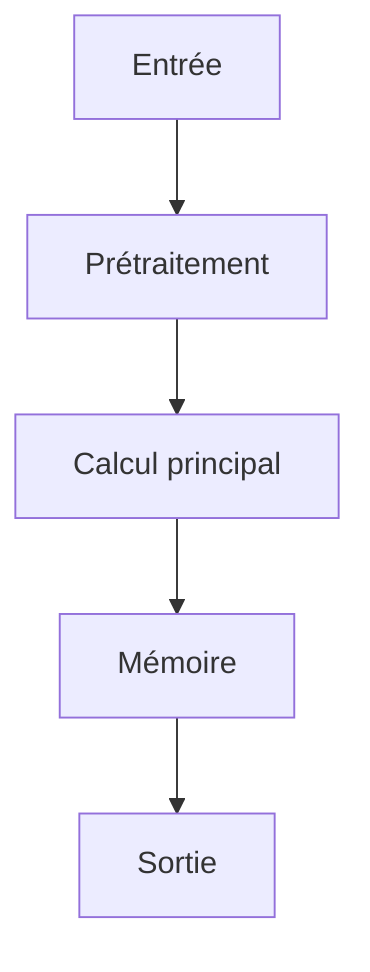

# Résumé Exécutif

Le papier 'fake_paper' est analysé dans le cadre de l'amélioration d'une architecture IA autonome locale/serveur. L'évaluation est préliminaire et requiert un examen humain complémentaire.

# Contributions Scientifiques


- Contribution principale à extraire manuellement à partir du texte complet.


# Analyse Mathématique

## Équations


Aucune équation extraite.


## Variables


- **M_t** : M_{t-1} * g_t + v_t * (1 - g_t)

- **L** : L_lm + lambda * L_contrastive


## Incertitudes


Aucune.


# Analyse Algorithmique

## Pseudo-code

```text

FONCTION ProcessPaper(input):
    état = InitialiserÉtat()
    données = Prétraiter(input)
    POUR CHAQUE étape:
        état = MettreÀJour(état, données)
    RETOURNER ProduireSortie(état)

```

## Complexité

- **Complexité globale** : INFORMATION NON DISPONIBLE DANS LE PAPIER
- **Coût mémoire** : INFORMATION NON DISPONIBLE DANS LE PAPIER

# Analyse Système

| Ressource | Valeur |
|-----------|--------|
| VRAM | INFORMATION NON DISPONIBLE DANS LE PAPIER |
| RAM | INFORMATION NON DISPONIBLE DANS LE PAPIER |
| I/O disque | INFORMATION NON DISPONIBLE DANS LE PAPIER |
| Bande passante mémoire | INFORMATION NON DISPONIBLE DANS LE PAPIER |
| Latence | INFORMATION NON DISPONIBLE DANS LE PAPIER |
| Débit | INFORMATION NON DISPONIBLE DANS LE PAPIER |
| Scalabilité | INFORMATION NON DISPONIBLE DANS LE PAPIER |

# Architecture du Flux



# Traduction Logicielle

## Structures


### rust

pub struct MemoryEntry {
    pub embedding: Vec<f32>,
    pub metadata: std::collections::HashMap<String, String>,
    pub timestamp: u64,
}

impl MemoryEntry {
    pub fn new(embedding: Vec<f32>) -> Self {
        Self { embedding, metadata: Default::default(), timestamp: 0 }
    }
}


### python

from typing import Protocol
import torch

class CognitiveModule(Protocol):
    def initialize(self) -> None: ...
    def process(self, input: torch.Tensor) -> torch.Tensor: ...
    def update_state(self) -> None: ...
    def save_state(self, path: str) -> None: ...


## Interfaces


### rust

pub trait CognitiveModule {
    fn initialize(&mut self);
    fn process(&mut self, input: Tensor) -> Tensor;
    fn update_state(&mut self);
    fn save_state(&self);
}


## API


### python

def initialize() -> None:
    ...

def load_state(path: str) -> None:
    ...

def save_state(path: str) -> None:
    ...

def process(input: torch.Tensor) -> torch.Tensor:
    ...

def update_memory(entry: MemoryEntry) -> None:
    ...

def evaluate() -> dict:
    ...

def self_reflect() -> None:
    ...

def shutdown() -> None:
    ...


## Algorithmes


### python

def algorithm(input_data):
    state = initialize_state()
    data = preprocess(input_data)
    for step in main_loop(data):
        state = update_state(state, step)
    return produce_output(state)


# Plan d'Expérimentation

- **Objectif** : Valider l'intégration de la technique décrite dans fake_paper
- **Hypothèse** : La technique améliore significativement les performances de l'architecture cible.
- **Baseline** : Architecture de référence sans la technique proposée.
- **Dataset** : Dataset public pertinent (à définir après lecture complète)
- **Métriques** : latence, débit, utilisation VRAM, précision
- **Matériel** : GPU ≥ 24 Go VRAM, 64-256 Go RAM, NVMe
- **Critères de succès** : Amélioration ≥ 5% sur la métrique principale
- **Critères d'échec** : Régression > 2%; Coût mémoire doublé
- **Durée estimée** : 1-2 semaines
- **Coût estimé** : Coût électricité GPU

# Plan de Tests

## Unitaires


- Vérifier les dimensions des tenseurs intermédiaires

- Tester la stabilité numérique

- Tester les cas limites (entrées vides, zéros, NaN)


## Intégration


- Mesurer le débit sous charge

- Mesurer la latence de bout en bout

- Vérifier la persistance de l'état


## Régression


- Comparer version baseline vs version modifiée

- S'assurer de l'absence de régression mémoire


# Analyse Critique

## Forces


- Travail potentiellement reproductible si le code est disponible.


## Faiblesses


- Analyse basée sur un texte partiel.


## Risques


- **RiskLevel.MEDIUM** : Aucun code source n'est associé à la publication. (Atténuation : Contacter les auteurs ou tenter une reproduction indépendante.)


## Zones d'incertitude


- L'analyse ci-dessus est préliminaire.


# Compatibilité Architecture Agentique

- **Mémoire** : Non impacté
- **Raisonnement** : Non impacté
- **Planification** : Non impacté
- **Action** : Non impacté
- **Réflexion** : Non impacté
- **Auto-amélioration** : Non impacté

# Recommandation Finale

**ARCHIVAGE**

Score d'intégration de 0.37 (EXPERIMENTATION). Décision à affiner après lecture complète.

Interprétation du score d'intégration : **EXPERIMENTATION**