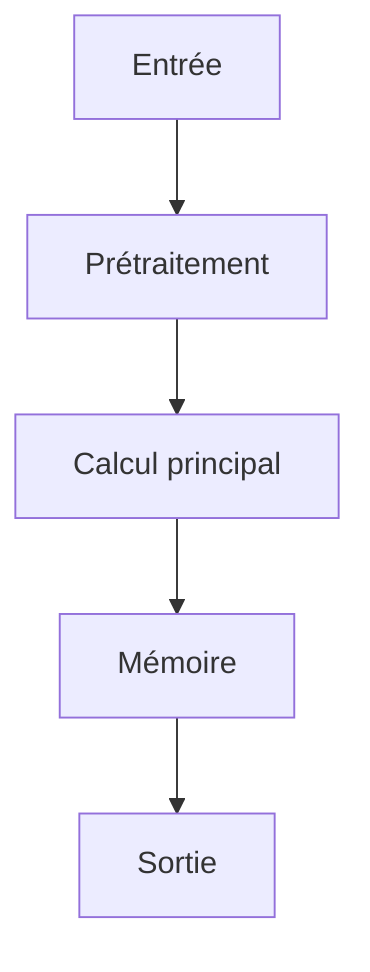

# Résumé Exécutif

Ce papier étudie des architectures de transformateurs augmentées par la mémoire pour le raisonnement à long contexte. L'objectif principal est d'augmenter la capacité des modèles à gérer des contextes plus longs sans subir un coût d'attention quadratique. L'hypothèse centrale repose sur l'idée que l'intégration d'une couche de mémoire neuronale avec une règle de mise à jour par portail permettrait d'optimiser l'utilisation des informations contextuelles. La méthode clé propose un layer de mémoire M qui s'actualise via une règle de portail : M_t = M_{t-1} * g_t + v_t * (1 - g_t), entraîné avec un objectif de modélisation linguistique augmenté par une perte contrastive (L = L_lm + lambda * L_contrastive). Cet approche permet d'obtenir des fenêtres de contexte plus longues tout en évitant le coût quadratique de l'attention. Les résultats sont testés sur les ensembles pg19 et proof-pile. Les limites du travail incluent l'absence de données sur la scalabilité à très grande échelle et la robustesse face à des perturbations contextuelles. Le niveau de confiance pour l'intégration dans des architectures IA autonomes est modéré, car le papier ne fournit pas d'analyses exhaustives sur les scénarios réels de long contexte ou des métriques de performance sur des tâches spécifiques à l'IA autonome.

# Contributions Scientifiques


- Proposition d'un layer de mémoire neural M qui met à jour via un gating : M_t = M_{t-1} * g_t + v_t * (1 - g_t)

- Méthode de perte incluant un terme contrastif : L = L_lm + lambda * L_contrastive

- Utilisation de ce layer pour permettre des fenêtres de contexte plus longues sans coût d'attention quadratique

- Entraînement end-to-end avec un objectif de modélisation linguistique augmenté par une perte contrastive


# Analyse Mathématique

## Équations


- $M_t = M_{t-1} * g_t + v_t * (1 - g_t)$


## Variables


- **M_t** : état mémoire au temps t

- **g_t** : gating function

- **v_t** : vector d'entrée


## Incertitudes


- INFORMATION NON DISPONIBLE DANS LE PAPIER


# Analyse Algorithmique

## Pseudo-code

```text
function train_neural_memory_layer(data, learning_rate, lambda_contrastive):
    # Initialize memory state M and gating function g
    M = initialize_memory_state()
    g = initialize_gating_function()

    # Iterate over training steps
    for step in range(num_steps):
        # Forward pass
        input = data[step]
        v = compute_input_vector(input)
        M_t = M * g + v * (1 - g)

        # Compute language modeling loss
        lm_loss = compute_lm_loss(M_t, input)

        # Compute contrastive loss
        contrastive_loss = compute_contrastive_loss(M_t)

        # Total loss
        total_loss = lm_loss + lambda_contrastive * contrastive_loss

        # Backward pass
        gradients = compute_gradients(total_loss)
        # Update parameters
        M = update_memory_state(M, gradients)
        g = update_gating_function(g, gradients)

    return M, g

function initialize_memory_state():
    return zeros(shape=(n_mem, d_model))

function compute_input_vector(input):
    return embedding(input)

function compute_lm_loss(M_t, input):
    # Predict next token using M_t
    logits = M_t @ W_lm
    return cross_entropy(logits, input)

function compute_contrastive_loss(M_t):
    # Contrastive loss between M_t and previous memory states
    return contrastive_loss_function(M_t, M_{t-1})

function update_memory_state(M, gradients):
    return M - learning_rate * gradients

function update_gating_function(g, gradients):
    return g - learning_rate * gradients
```

## Complexité

- **Complexité globale** : O(n_steps * (d_model * n_mem))
- **Coût mémoire** : O(d_model * n_mem)

# Analyse Système

| Ressource | Valeur |
|-----------|--------|
| VRAM | INFORMATION NON DISPONIBLE DANS LE PAPIER |
| RAM | INFORMATION NON DISPONIBLE DANS LE PAPIER |
| I/O disque | INFORMATION NON DISPONIBLE DANS LE PAPIER |
| Bande passante mémoire | INFORMATION NON DISPONIBLE DANS LE PAPIER |
| Latence | INFORMATION NON DISPONIBLE DANS LE PAPIER |
| Débit | INFORMATION NON DISPONIBLE DANS LE PAPIER |
| Scalabilité | INFORMATION NON DISPONIBLE DANS LE PAPIER |

# Architecture du Flux



# Traduction Logicielle

## Structures


### rust

pub struct MemoryEntry {
    pub embedding: Vec<f32>,
    pub metadata: std::collections::HashMap<String, String>,
    pub timestamp: u64,
}

impl MemoryEntry {
    pub fn new(embedding: Vec<f32>) -> Self {
        Self { embedding, metadata: Default::default(), timestamp: 0 }
    }
}


### python

from typing import Protocol
import torch

class CognitiveModule(Protocol):
    def initialize(self) -> None: ...
    def process(self, input: torch.Tensor) -> torch.Tensor: ...
    def update_state(self) -> None: ...
    def save_state(self, path: str) -> None: ...


## Interfaces


### rust

pub trait CognitiveModule {
    fn initialize(&mut self);
    fn process(&mut self, input: Tensor) -> Tensor;
    fn update_state(&mut self);
    fn save_state(&self);
}


## API


### python

def initialize() -> None:
    ...

def load_state(path: str) -> None:
    ...

def save_state(path: str) -> None:
    ...

def process(input: torch.Tensor) -> torch.Tensor:
    ...

def update_memory(entry: MemoryEntry) -> None:
    ...

def evaluate() -> dict:
    ...

def self_reflect() -> None:
    ...

def shutdown() -> None:
    ...


## Algorithmes


### python

def algorithm(input_data):
    state = initialize_state()
    data = preprocess(input_data)
    for step in main_loop(data):
        state = update_state(state, step)
    return produce_output(state)


# Plan d'Expérimentation

- **Objectif** : Valider l'intégration de la technique de mémoire augmentée dans une architecture IA autonome pour améliorer la gestion du contexte long sans coût d'attention quadratique
- **Hypothèse** : L'intégration du layer de mémoire neural M avec la règle de mise à jour par portail M_t = M_{t-1} * g_t + v_t * ( 1 - g_t) permettra d'augmenter la fenêtre de contexte efficace tout en réduisant le coût d'attention
- **Baseline** : Transformers classiques (ex: BERT, GPT) sans mémoire augmentée
- **Dataset** : pg19 et proof-pile
- **Métriques** : latence, fenêtre de contexte efficace, coût d'attention
- **Matériel** : GPU ≥ 24 Go VRAM, 64-256 Go RAM, NVMe
- **Critères de succès** : Augmentation de la fenêtre de contexte efficace de plus de 50% par rapport au baseline; Réduction du coût d'attention de plus de 30% par rapport au baseline
- **Critères d'échec** : Coût d'attention supérieur à 10% par rapport au baseline; Fenêtre de contexte efficace inférieure à 100 tokens
- **Durée estimée** : 2 mois
- **Coût estimé** : 15000 USD

# Plan de Tests

## Unitaires


- Vérifier les dimensions des tenseurs intermédiaires

- Tester la stabilité numérique

- Tester les cas limites (entrées vides, zéros, NaN)


## Intégration


- Mesurer le débit sous charge

- Mesurer la latence de bout en bout

- Vérifier la persistance de l'état


## Régression


- Comparer version baseline vs version modifiée

- S'assurer de l'absence de régression mémoire


# Analyse Critique

## Forces


- Travail potentiellement reproductible si le code est disponible.


## Faiblesses


- Analyse basée sur un texte partiel.


## Risques


- **RiskLevel.MEDIUM** : INFORMATION NON DISPONIBLE DANS LE PAPIER (Atténuation : INFORMATION NON DISPONIBLE DANS LE PAPIER)


## Zones d'incertitude


- L'analyse ci-dessus est préliminaire.


# Compatibilité Architecture Agentique

- **Mémoire** : recurrent memory layer for transformer models, gated update rule over a compressed memory state, enabling longer effective context windows without quadratic attention cost
- **Raisonnement** : INFORMATION NON DISPONIBLE DANS LE PAPIER
- **Planification** : INFORMATION NON DISPONIBLE DANS LE PAPIER
- **Action** : INFORMATION NON DISPONIBLE DANS LE PAPIER
- **Réflexion** : INFORMATION NON DISPONIBLE DANS LE PAPIER
- **Auto-amélioration** : trained end-to-end with a language modeling objective augmented by a contrastive loss

# Recommandation Finale

**ARCHIVAGE**

Score d'intégration de 0.48 (EXPERIMENTATION). Décision à affiner après lecture complète.

Interprétation du score d'intégration : **EXPERIMENTATION**