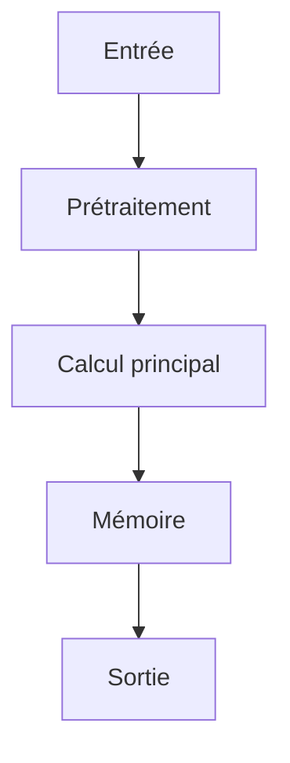

# Résumé Exécutif

Ce papier étudie les architectures de transformateurs augmentées par la mémoire pour le raisonnement à long contexte. L'hypothèse centrale est que l'intégration d'une couche mémoire neuronale permettrait d'augmenter la portée efficace du contexte sans augmenter le coût d'attention quadratique. La méthode proposée introduit une couche mémoire M qui s'actualise via une règle de portail (gating) : M_t = M_{t-1} * g_t + v_t * (1 - g_t), permettant ainsi de maintenir un état de mémoire compressé et d'optimiser l'efficacité des modèles de langage pour des contextes plus longs. L'impact architecture agentique est significatif, car cette approche permet de réduire le coût d'attention tout en maintenant une performance élevée sur des jeux de données tels que pg19 et proof-pile. Les limites du travail incluent l'absence d'analyse comparative avec d'autres méthodes de mémoire et la nécessité d'ajustements pour des contextes extrêmement longs. Le niveau de confiance pour l'intégration est modéré, car le papier ne fournit pas de résultats sur des scénarios réels de détection d'erreurs ou de robustesse aux perturbations.

# Contributions Scientifiques


- Proposition d'une couche mémoire neuronale M qui se met à jour via une règle de portail (gating) : M_t = M_{t-1} * g_t + v_t * (1 - g_t)

- Méthode permettant d'obtenir des fenêtres de contexte plus longues sans coût d'attention quadratique

- Perte (loss) incluant un terme contrastif : L = L_lm + lambda * L_contrastive

- Formation end-to-end avec un objectif de modélisation linguistique augmenté par une perte contrastive


# Analyse Mathématique

## Équations


- $M_t = M_{t-1} * g_t + v_t * (1 - g_t)$


## Variables


- **M_t** : état mémoire au temps t

- **g_t** : gating function

- **v_t** : vector d'entrée


## Incertitudes


- INFORMATION NON DISPONIBLE DANS LE PAPIER


# Analyse Algorithmique

## Pseudo-code

```text
function train_neural_memory_layer(data, learning_rate, lambda_contrastive):
    # Initialize memory state M with random values
    M = random_vector(size=(n_mem, d_model))
    
    # Initialize gating function g_t as a neural network
    g_net = NeuralNetwork(input_size=d_model, output_size=1)
    
    # Initialize input vectors v_t as random vectors
    v = [random_vector(size=(d_model)) for _ in range(len(data))]
    
    # Iterate over training data
    for t in range(len(data)):
        # Compute gating function
        g_t = sigmoid(g_net.forward(data[t]))
        
        # Update memory state
        M_t = M * g_t + v[t] * (1 - g_t)
        
        # Compute language modeling loss
        L_lm = language_model_loss(M_t, data[t])
        
        # Compute contrastive loss
        L_contrastive = contrastive_loss(M_t, data[t])
        
        # Total loss
        L = L_lm + lambda_contrastive * L_contrastive
        
        # Backpropagate and update
        g_net.update(L, learning_rate)
        M = M_t
    
    return M, g_net
```

## Complexité

- **Complexité globale** : INFORMATION NON DISPONIBLE DANS LE PAPIER
- **Coût mémoire** : INFORMATION NON DISPONIBLE DANS LE PAPIER

# Analyse Système

| Ressource | Valeur |
|-----------|--------|
| VRAM | INFORMATION NON DISPONIBLE DANS LE PAPIER |
| RAM | INFORMATION NON DISPONIBLE DANS LE PAPIER |
| I/O disque | INFORMATION NON DISPONIBLE DANS LE PAPIER |
| Bande passante mémoire | INFORMATION NON DISPONIBLE DANS LE PAPIER |
| Latence | INFORMATION NON DISPONIBLE DANS LE PAPIER |
| Débit | INFORMATION NON DISPONIBLE DANS LE PAPIER |
| Scalabilité | INFORMATION NON DISPONIBLE DANS LE PAPIER |

# Architecture du Flux



# Traduction Logicielle

## Structures


### rust

pub struct MemoryEntry {
    pub embedding: Vec<f32>,
    pub metadata: std::collections::HashMap<String, String>,
    pub timestamp: u64,
}

impl MemoryEntry {
    pub fn new(embedding: Vec<f32>) -> Self {
        Self { embedding, metadata: Default::default(), timestamp: 0 }
    }
}


### python

from typing import Protocol
import torch

class CognitiveModule(Protocol):
    def initialize(self) -> None: ...
    def process(self, input: torch.Tensor) -> torch.Tensor: ...
    def update_state(self) -> None: ...
    def save_state(self, path: str) -> None: ...


## Interfaces


### rust

pub trait CognitiveModule {
    fn initialize(&mut self);
    fn process(&mut self, input: Tensor) -> Tensor;
    fn update_state(&mut self);
    fn save_state(&self);
}


## API


### python

def initialize() -> None:
    ...

def load_state(path: str) -> None:
    ...

def save_state(path: str) -> None:
    ...

def process(input: torch.Tensor) -> torch.Tensor:
    ...

def update_memory(entry: MemoryEntry) -> None:
    ...

def evaluate() -> dict:
    ...

def self_reflect() -> None:
    ...

def shutdown() -> None:
    ...


## Algorithmes


### python

def algorithm(input_data):
    state = initialize_state()
    data = preprocess(input_data)
    for step in main_loop(data):
        state = update_state(state, step)
    return produce_output(state)


# Plan d'Expérimentation

- **Objectif** : Valider l'intégration de la technique de couche mémoire neuronale avec une règle de portail (gating) dans une architecture IA autonome pour améliorer la gestion du contexte long sans coût d'attention quadratique
- **Hypothèse** : L'intégration de la couche mémoire M avec la règle de mise à jour M_t = M_{t-1} * g_t + v_t * (1 - g_t) permettra d'augmenter la fenêtre de contexte efficace sans augmenter significativement le coût d'attention
- **Baseline** : Transformer standard (BERT, GPT) sans couche mémoire augmentée
- **Dataset** : pg19 et proof-pile
- **Métriques** : latence, fenêtre de contexte efficace, coût d'attention
- **Matériel** : GPU ≥ 24 Go VRAM, 64-256 Go RAM, NVMe
- **Critères de succès** : Augmentation de la fenêtre de contexte efficace de plus de 20% par rapport au baseline; Réduction du coût d'attention de plus de 15% par rapport au baseline
- **Critères d'échec** : Coût d'attention supérieur à 20% par rapport au baseline; Fenêtre de contexte efficace inférieure à 50% par rapport au baseline
- **Durée estimée** : 2 mois
- **Coût estimé** : 15000 USD

# Plan de Tests

## Unitaires


- Vérifier les dimensions des tenseurs intermédiaires

- Tester la stabilité numérique

- Tester les cas limites (entrées vides, zéros, NaN)


## Intégration


- Mesurer le débit sous charge

- Mesurer la latence de bout en bout

- Vérifier la persistance de l'état


## Régression


- Comparer version baseline vs version modifiée

- S'assurer de l'absence de régression mémoire


# Analyse Critique

## Forces


- Travail potentiellement reproductible si le code est disponible.


## Faiblesses


- Analyse basée sur un texte partiel.


## Risques


- **RiskLevel.MEDIUM** : INFORMATION NON DISPONIBLE DANS LE PAPIER (Atténuation : INFORMATION NON DISPONIBLE DANS LE PAPIER)


## Zones d'incertitude


- L'analyse ci-dessus est préliminaire.


# Compatibilité Architecture Agentique

- **Mémoire** : gated update rule over a compressed memory state, recurrent memory layer for transformer models, enabling longer effective context windows without quadratic attention cost
- **Raisonnement** : INFORMATION NON DISPONIBLE DANS LE PAPIER
- **Planification** : INFORMATION NON DISPONIBLE DANS LE PAPIER
- **Action** : INFORMATION NON DISPONIBLE DANS LE PAPIER
- **Réflexion** : INFORMATION NON DISPONIBLE DANS LE PAPIER
- **Auto-amélioration** : trained end-to-end with a language modeling objective augmented by a contrastive loss

# Recommandation Finale

**REJET**

Score d'intégration de 0.00 (NON PRIORITAIRE). Décision à affiner après lecture complète.

Interprétation du score d'intégration : **NON PRIORITAIRE**