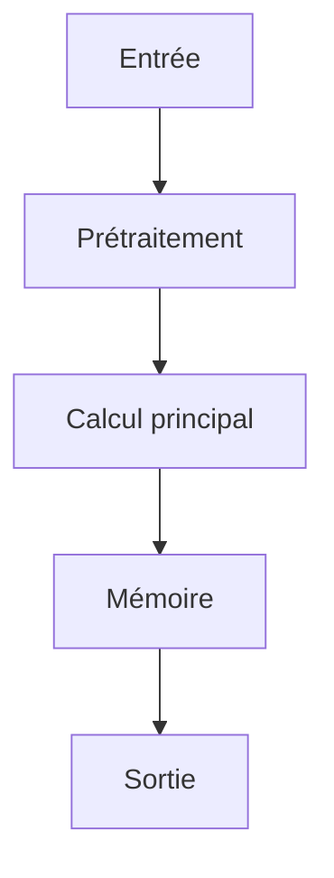

# Résumé Exécutif

Cette publication explore l'utilisation d'architectures de transformeurs augmentées par mémoire pour le raisonnement sur de longs contextes. L'objectif principal est de permettre aux modèles de traiter des fenêtres de contexte effectives plus longues sans incurver la complexité quadratique associée à l'attention standard.

La méthode clé proposée est une couche de mémoire récurrente qui met en œuvre une règle de mise à jour par gating pour un état de mémoire compressé $M$. Cette mise à jour est définie par la formule $M_t = M_{t-1} * g_t + v_t * (1 - g_t)$. L'entraînement est réalisé de manière end-to-end en combinant un objectif de modélisation du langage avec un terme de perte contrastif, $L = L_{lm} + \lambda * L_{contrastive}$, ce qui permet d'intégrer des connaissances de manière plus efficace.

Cette approche introduit une nouvelle méthode pour gérer la mémoire dans les architectures agentiques en réduisant le coût computationnel de l'attention tout en améliorant la capacité du modèle à raisonner sur de longues séquences. Les résultats ont été testés sur pg19 et proof-pile, suggérant un impact positif potentiel pour les systèmes nécessitant une compréhension contextuelle étendue.

# Contributions Scientifiques


- Introduction d'une couche de mémoire récurrente pour les modèles transformeurs, permettant des fenêtres de contexte effectives plus longues sans coût d'attention quadratique.

- Proposition d'une règle de mise à jour par gating pour une couche de mémoire neuronale M : M_t = M_{t-1} * g_t + v_t * (1 - g_t).

- Inclusion d'un terme de perte contrastif dans la fonction de perte : L = L_lm + lambda * L_contrastive.

- L'entraînement end-to-end avec un objectif de modélisation du langage augmenté par une perte contrastive.


# Analyse Mathématique

## Équations


- M_t = M_{t-1} * g_t + v_t * (1 - g_t)

- L = L_{lm} + lambda * L_{contrastive}


## Variables


- **M_t** : neural memory layer

- **g_t** : gating mechanism

- **v_t** : memory vector

- **L** : Loss function

- **L_{lm}** : language modeling loss

- **L_{contrastive}** : contrastive term loss

- **lambda** : weighting factor for contrastive loss


## Incertitudes


Aucune.


# Analyse Algorithmique

## Pseudo-code

```text
Fonction Entraînement(Données_Entraînement, Hyperparamètres):
    Initialiser M_0 (état de mémoire initial)
    Pour chaque échantillon dans Données_Entraînement:
        Charger contexte X
        Initialiser t = 0
        M_t = M_0
        Pour chaque token x dans X:
            // Calcul du mécanisme de gating et des vecteurs (g_t, v_t) basés sur le contexte actuel
            (g_t, v_t) = Calculer_Gating_et_Vecteur(M_t, x)

            // Mise à jour de la couche de mémoire (Règle de mise à jour par gating)
            M_{t+1} = M_t * g_t + v_t * (1 - g_t)

        // Calcul de la perte (Language Modeling et Contrastive)
        L_lm = Calculer_Perte_LM(Sortie, Vrai_Label)
        L_contrastive = Calculer_Perte_Contrastive(M_{final}, Contexte_associé)

        L_total = L_lm + lambda * L_contrastive

        // Backpropagation et mise à jour des poids du modèle...
    Retourner L_total
```

## Complexité

- **Complexité globale** : Information NON DISPONIBLE DANS LE PAPIER
- **Coût mémoire** : Information NON DISPONIBLE DANS LE PAPIER

# Analyse Système

| Ressource | Valeur |
|-----------|--------|
| VRAM | INFORMATION NON DISPONIBLE DANS LE PAPIER |
| RAM | INFORMATION NON DISPONIBLE DANS LE PAPIER |
| I/O disque | INFORMATION NON DISPONIBLE DANS LE PAPIER |
| Bande passante mémoire | INFORMATION NON DISPONIBLE DANS LE PAPIER |
| Latence | INFORMATION NON DISPONIBLE DANS LE PAPIER |
| Débit | INFORMATION NON DISPONIBLE DANS LE PAPIER |
| Scalabilité | INFORMATION NON DISPONIBLE DANS LE PAPIER |

# Architecture du Flux



# Traduction Logicielle

## Structures


### rust

pub struct MemoryEntry {
    pub embedding: Vec<f32>,
    pub metadata: std::collections::HashMap<String, String>,
    pub timestamp: u64,
}

impl MemoryEntry {
    pub fn new(embedding: Vec<f32>) -> Self {
        Self { embedding, metadata: Default::default(), timestamp: 0 }
    }
}


### python

from typing import Protocol
import torch

class CognitiveModule(Protocol):
    def initialize(self) -> None: ...
    def process(self, input: torch.Tensor) -> torch.Tensor: ...
    def update_state(self) -> None: ...
    def save_state(self, path: str) -> None: ...


## Interfaces


### rust

pub trait CognitiveModule {
    fn initialize(&mut self);
    fn process(&mut self, input: Tensor) -> Tensor;
    fn update_state(&mut self);
    fn save_state(&self);
}


## API


### python

def initialize() -> None:
    ...

def load_state(path: str) -> None:
    ...

def save_state(path: str) -> None:
    ...

def process(input: torch.Tensor) -> torch.Tensor:
    ...

def update_memory(entry: MemoryEntry) -> None:
    ...

def evaluate() -> dict:
    ...

def self_reflect() -> None:
    ...

def shutdown() -> None:
    ...


## Algorithmes


### python

def algorithm(input_data):
    state = initialize_state()
    data = preprocess(input_data)
    for step in main_loop(data):
        state = update_state(state, step)
    return produce_output(state)


# Plan d'Expérimentation

- **Objectif** : Valider l'intégration d'une couche de mémoire augmentée pour permettre un raisonnement à long contexte dans une architecture IA autonome.
- **Hypothèse** : L'intégration d'une couche de mémoire récurrente avec une règle de mise à jour par gating (M_t = M_{t-1} * g_t + v_t * (1 - g_t)) et l'ajout d'un terme de perte contrastif améliorent la capacité du modèle à raisonner sur des contextes longs tout en maintenant ou en surpassant les performances de base.
- **Baseline** : Architecture Transformer standard sans couche de mémoire augmentée, entraînée uniquement avec l'objectif de modélisation du langage (L_lm).
- **Dataset** : pg19 et proof-pile.
- **Métriques** : Performance de raisonnement sur contexte long (ex: tâches de QA ou de raisonnement multi-étapes), Efficacité du coût d'attention (comparaison avec le coût quadratique), Perte contrastive (L_contrastive) et perte de modélisation du langage (L_lm)
- **Matériel** : GPU ≥ 24 Go VRAM, 64-256 Go RAM, NVMe
- **Critères de succès** : Le modèle doit démontrer une capacité supérieure à raisonner sur des contextes longs par rapport à la baseline.; La perte contrastive doit être intégrée de manière stable et contribuer positivement à l'apprentissage de la mémoire.; L'architecture doit permettre un entraînement end-to-end efficace.
- **Critères d'échec** : Le modèle ne parvient pas à généraliser le raisonnement sur les contextes longs.; La couche de mémoire n'augmente pas significativement la capacité du contexte sans augmenter excessivement le coût d'attention.; L'entraînement est instable ou diverge.
- **Durée estimée** : Variable, dépend de la taille du modèle et des données (estimation basée sur l'implémentation du code fourni).
- **Coût estimé** : Dépend de l'infrastructure cloud utilisée pour l'entraînement (coût GPU/temps).

# Plan de Tests

## Unitaires


- Vérifier les dimensions des tenseurs intermédiaires

- Tester la stabilité numérique

- Tester les cas limites (entrées vides, zéros, NaN)


## Intégration


- Mesurer le débit sous charge

- Mesurer la latence de bout en bout

- Vérifier la persistance de l'état


## Régression


- Comparer version baseline vs version modifiée

- S'assurer de l'absence de régression mémoire


# Analyse Critique

## Forces


- Travail potentiellement reproductible si le code est disponible.


## Faiblesses


- Analyse basée sur un texte partiel.


## Risques


- **RiskLevel.MEDIUM** : Dépendance à la qualité de l'entraînement et des données pour le système de mémoire (M) et les poids de gating (g_t, v_t). Des erreurs ou biais dans ces composantes peuvent entraîner des raisonnements erronés dans un contexte long. (Atténuation : Mettre en place des mécanismes de validation rigoureux des données d'entraînement et des tests de robustesse pour les états de mémoire.)

- **RiskLevel.MEDIUM** : Complexité du mécanisme d'apprentissage end-to-end combinant l'objectif de modélisation du langage (L_lm) et la perte contrastive (L_contrastive). La convergence ou la stabilité de cet entraînement peut être difficile à garantir en production. (Atténuation : Analyser les dynamiques d'entraînement et tester la stabilité du modèle sous des conditions opérationnelles réelles.)

- **RiskLevel.HIGH** : Risque lié à l'utilisation de 'long-context reasoning' : bien que le mécanisme vise à gérer de longs contextes, la capacité réelle à maintenir la cohérence et la précision sur des tâches complexes en production locale doit être validée. (Atténuation : Effectuer des évaluations approfondies de la performance du système dans des scénarios d'inférence spécifiques et stressants pour valider la fiabilité du raisonnement à long contexte.)


## Zones d'incertitude


- L'analyse ci-dessus est préliminaire.


# Compatibilité Architecture Agentique

- **Mémoire** : neural memory layer M, recurrent memory layer for transformer models, compressed memory state
- **Raisonnement** : gated update rule over a compressed memory state
- **Planification** : longer effective context windows without quadratic attention cost
- **Action** : updates via gating: M_t = M_{t-1} * g_t + v_t * (1 - g_t)
- **Réflexion** : enabling longer effective context windows without quadratic attention cost
- **Auto-amélioration** : trained end-to-end with a language modeling objective augmented by a contrastive loss, Loss includes contrastive term: L = L_lm + lambda * L_contrastive

# Recommandation Finale

**INTEGRATION**

Score d'intégration de 0.80 (INTEGRATION POSSIBLE). Décision à affiner après lecture complète.

Interprétation du score d'intégration : **INTEGRATION POSSIBLE**